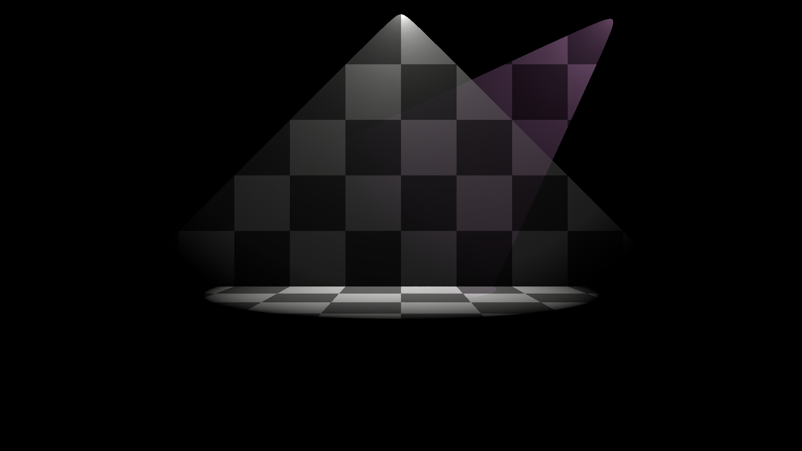

# Spot light
## Run this script URL: [Manual](https://raw.githubusercontent.com/highfidelity/hifi_tests/master/tests/content/entity/light/spot/create/test.js)   [Auto](https://raw.githubusercontent.com/highfidelity/hifi_tests/master/tests/content/entity/light/spot/create/testAuto.js)(from menu/Edit/Open and Run scripts from URL...).

## Preconditions
- In an empty region of a domain with editing rights.

## Steps
Press 'n' key to advance step by step

### Step 1
- Wait for entities to load
### Step 2
- Display the 2 spotlights
- 
### Step 3
- Clean up after test
