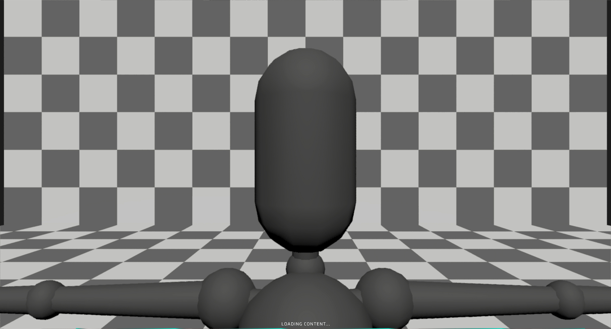

# Apply Material Entities to Avatars
## Run this script URL: [Manual](./test.js?raw=true)   [Auto](./testAuto.js?raw=true)(from menu/Edit/Open and Run scripts from URL...).

## Preconditions
- In an empty region of a domain with editing rights.

## Platforms
Run the test on each of the following platforms
## Displays
Run the test on each of the following displays
## Processors
Run the test on each of the following processors
## Graphics Cards
Run the test on graphics cards from each of the following vendors
## Steps
Press space bar to advance step by step

### Step 1
- Take snapshot
- 
