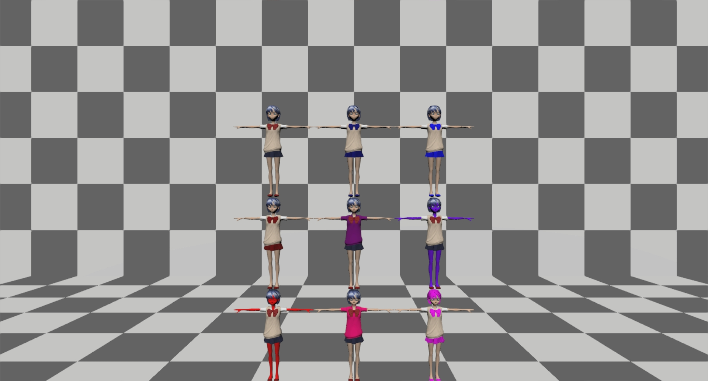

# Apply Material Entities to Model Overlays
## Run this script URL: [Manual](https://raw.githubusercontent.com/highfidelity/hifi_tests/master/tests/content/entity/material/apply/overlays/model/test.js)   [Auto](https://raw.githubusercontent.com/highfidelity/hifi_tests/master/tests/content/entity/material/apply/overlays/model/testAuto.js)(from menu/Edit/Open and Run scripts from URL...).

## Preconditions
- In an empty region of a domain with editing rights.

## Steps
Press 'n' key to advance step by step

### Step 1
- Display materials on multiple model overlays
- 
### Step 2
- Clean up after test
