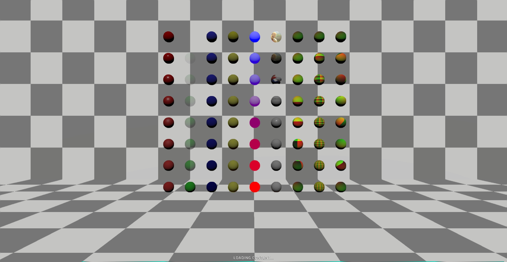
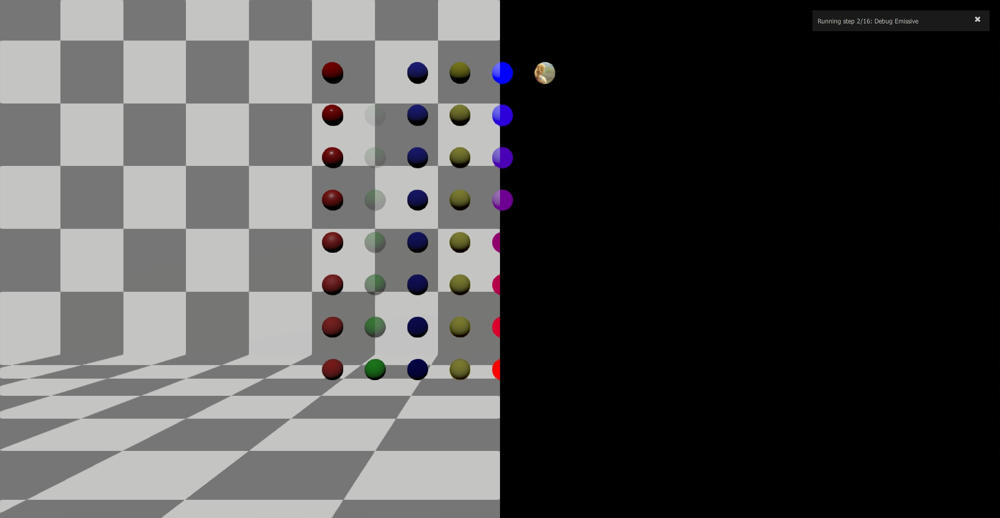
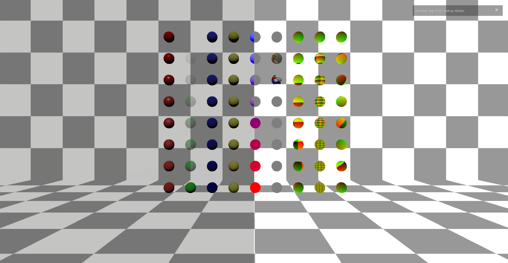
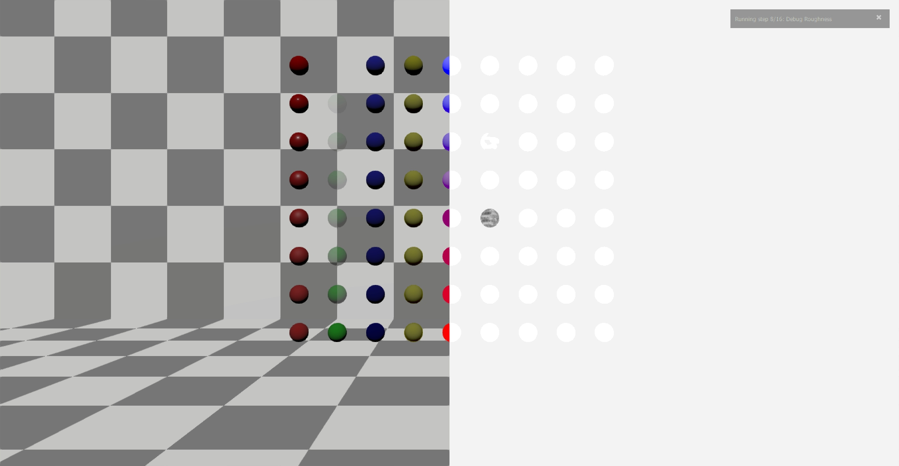
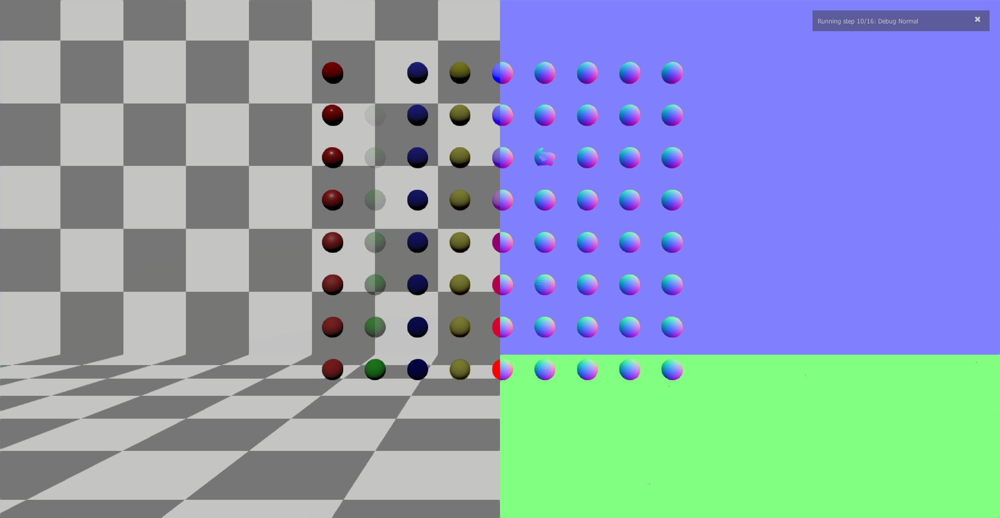
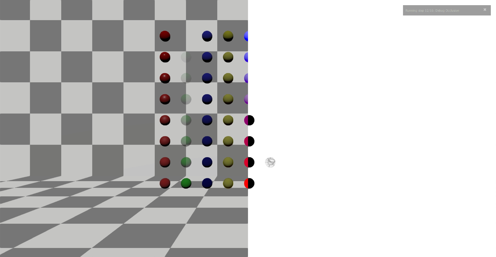
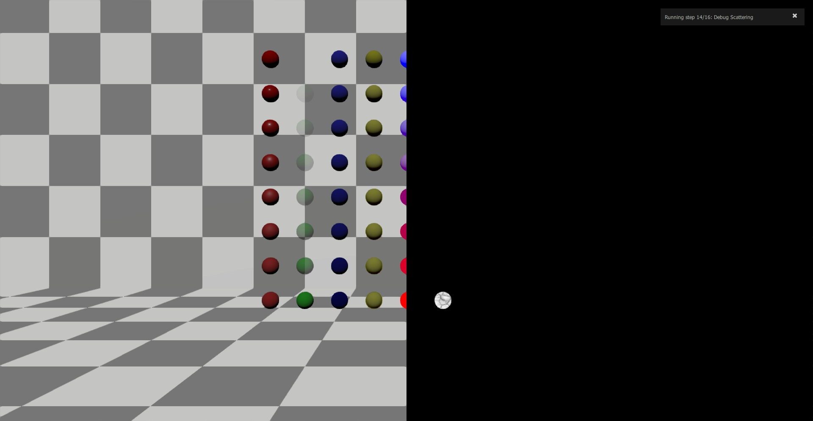

# Material Entities Create

### Preconditions
In an empty region of a domain with editing rights

### Steps

#### Step 1
- run this [script URL](./test.js?raw=true) (from menu/Edit/Open and Run scripts From URL...). 
- The auto tester will run, generating 8 images, which, in order of creation, should match these images:
- 
- 
- 
- 
- 
- 
- 
- 