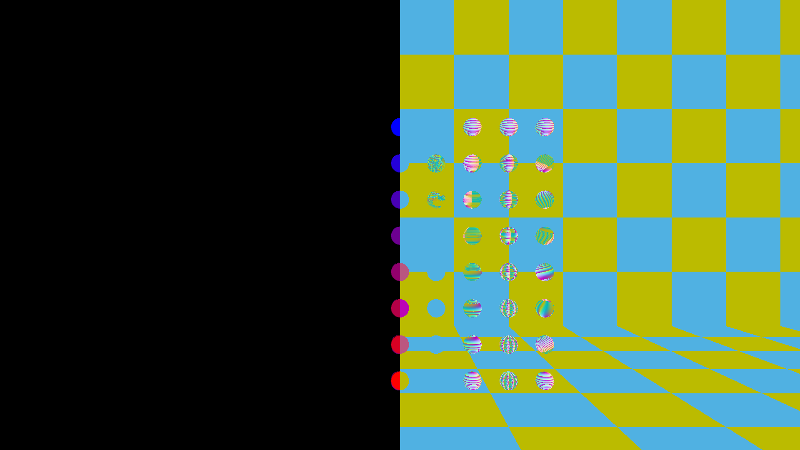
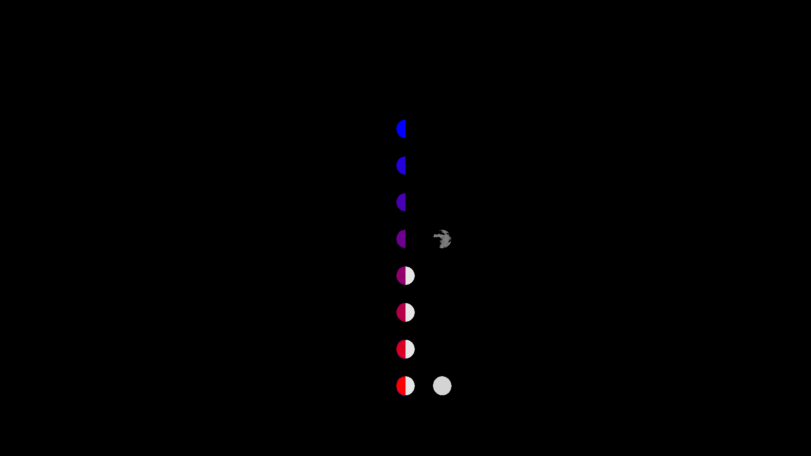

# Material Entities
## Run this script URL: [Manual](./test.js?raw=true)   [Auto](./testAuto.js?raw=true)(from menu/Edit/Open and Run scripts from URL...).

## Preconditions
- In an empty region of a domain with editing rights.

## Steps
Press n key to advance step by step

### Step 1
- Start in non-debug mode
### Step 2
- Take snapshot when not in Debug mode
- 
### Step 3
- Debug Emissive
### Step 4
- Take snapshot
- 
### Step 5
- Debug Albedo
### Step 6
- Take snapshot
- 
### Step 7
- Debug Metallic
### Step 8
- Take snapshot
- 
### Step 9
- Debug Roughness
### Step 10
- Take snapshot
- 
### Step 11
- Debug Normal
### Step 12
- Take snapshot
- 
### Step 13
- Debug Occlusion
### Step 14
- Take snapshot
- 
### Step 15
- Debug Scattering
### Step 16
- Take snapshot
- 
### Step 17
- Clean up after test
