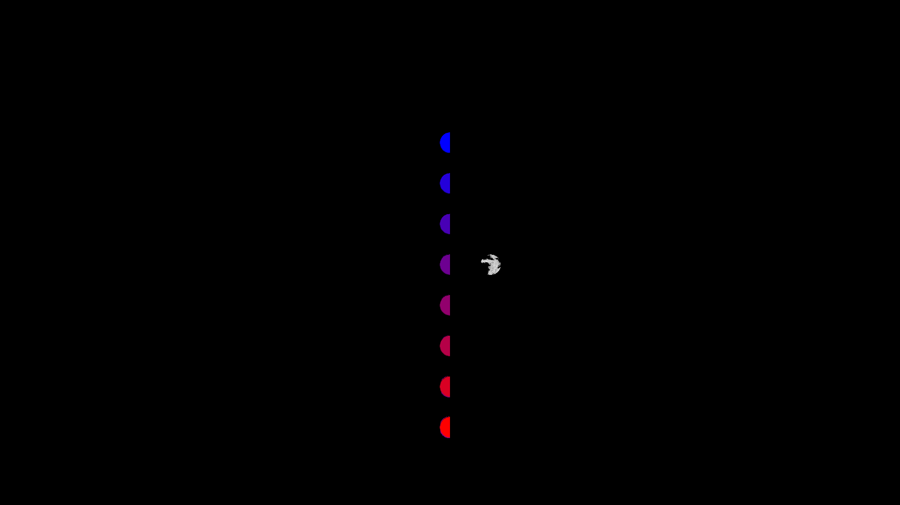

# Material Entities
## Run this script URL: [Manual](./test.js?raw=true)   [Auto](./testAuto.js?raw=true)(from menu/Edit/Open and Run scripts from URL...).

## Preconditions
- In an empty region of a domain with editing rights.

## Steps
Press space bar to advance step by step

### Step 1
- Take snapshot
- 
### Step 2
- Take snapshot
- 
### Step 3
- Take snapshot
- 
### Step 4
- Take snapshot
- 
### Step 5
- Take snapshot
- 
### Step 6
- Take snapshot
- 
### Step 7
- Take snapshot
- 
### Step 8
- Take snapshot
- 
