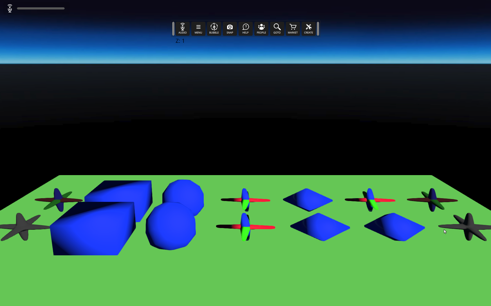

# Entity Model Physics
### Preconditions
Interface is running, logged in an empty region of a domain with editing rights

### Steps

#### Step 1
- Run this [script URL](./test.js?raw=true) (from menu/Edit/Open and Run scripts From URL...)
- Expected 
#### Step 2
- Click the mouse on any of the sample shapes.
- Expected : a temporary (60s) dynamic copy of the clicked entity will be created and will fall to the floor
#### Step 3
- Notice how the dynamic object collides and tumbles
- Expected: it should collide according to its shape
#### Step 4
- Using the **Create** mode select one of the sample shapes and change its scale.  Click on it to create a new scaled copy.
- Expected : a temporary dynamic copy of the scaled entity will be created and will fall to the floor.
#### Step 5
- Notice how the scaled dynamic object collides and tumbles
- Expected: it should collide according to its shape

#### Step 1
- Make sure this menu option is disabled: **Developer --> Physics --> Draw Collision Shapes**.
- Expected  "
#### Step 2
- Copy this [script URL](./test.js?raw=true) and **Edit --> Open and Run Script from URL...**
- Expected : Temporary (120 sec) objects will be created: a floor and two rows of models (six columns).  From left to right the columns use the following **Collision shape types** property:

No Collision
Box
Sphere
Compound
Basic - Whole model
Good - Sub-shapes
Exact - All polygons (non-dynamic only)

You should see something like this:

#### Step 3
- Enable this menu option: **Developer --> Physics --> Draw Collision Shapes**.
- Expected : You should see something like this:

#### Step 4
- Bump your avatar into the various model instances.
- Expected : The objects should collide as they appear.
