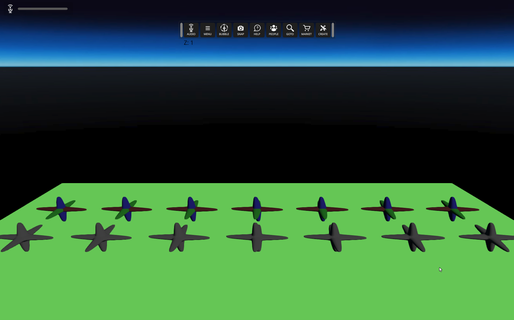

# Entity Model Physics
### Preconditions
Interface is running, logged in an empty region of a domain with editing rights

### Steps

#### Step 1
- Make sure this menu option is disabled: **Developer --> Physics --> Show Bullet Collision**.
- Expected  "
#### Step 2
- Copy this [script URL](./testStory.js?raw=true) and **Edit --> Open and Run Script from URL...**
- Expected : Temporary (120 sec) objects will be created: a floor and two rows of models (six columns).  From left to right the columns use the following **Collision shape types** property:

No Collision
Box
Sphere
Compound
Basic - Whole model
Good - Sub-shapes
Exact - All polygons (non-dynamic only)

You should see something like this:

#### Step 3
- Enable this menu option: **Developer --> Physics --> Show Bullet Collision**.
- Expected : You should see something like this:
#### Step 4
- Bump your avatar into the various model instances.
- Expected : The objects should collide as they appear.
