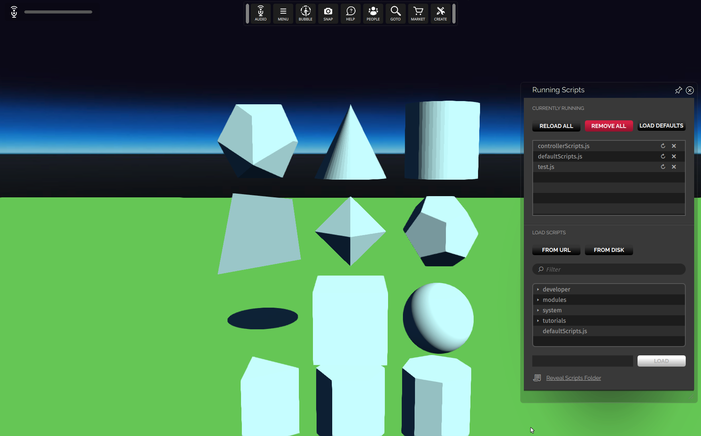

# Entity Shape Physics
### Preconditions
Interface is running, logged in an empty region of a domain with editing rights

### Steps

#### Step 1
- Run this [script URL](./testStory.js?raw=true) (from menu/Edit/Open and Run scripts From URL...)
- Expected 
#### Step 2
- Click the mouse on any of the sample shapes.
- Expected : a temporary (60s) dynamic copy of the clicked entity will be created and will fall to the floor
#### Step 3
- Notice how the dynamic object collides and tumbles
- Expected: it should collide according to its shape
#### Step 4
- Using the **Create** mode select one of the sample shapes and change its scale.  Click on it to create a new scaled copy.
- Expected : a temporary dynamic copy of the scaled entity will be created and will fall to the floor.
#### Step 5
- Notice how the scaled dynamic object collides and tumbles
- Expected: it should collide according to its shape
