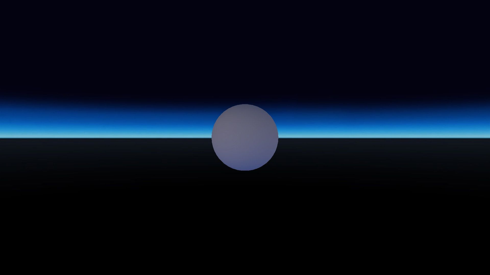

# Ambient Light Inheritance
## General
This test will build the following zone hierarchy:

 

The tests consist of setting ambient light component parameters and moving through the zones.  In each zone, the keylight modes are changed.

## Preconditions
In an empty region of a domain with editing rights.

## Automatic Test
Load script <https://raw.githubusercontent.com/NissimHadar/hifi_tests/addRecursionToAutotester/tests/content/entity/zone/ambientLightInheritance/testAuto.js>
## Manual Test
Load script <https://raw.githubusercontent.com/NissimHadar/hifi_tests/addRecursionToAutotester/tests/content/entity/zone/ambientLightInheritance/test.js>

Press space bar to advance step by step
## Performing step by step
Load script <https://raw.githubusercontent.com/NissimHadar/hifi_tests/addRecursionToAutotester/tests/content/entity/zone/ambientLightInheritance/test.js>

1. Stand in red zone
2. Verify bright ambient light
 
3. Move to green zone
4. Verify medium ambient light
 
5. Move to blue zone
6. Verify dark ambient light
 
7. Set blue zone ambient light to off
8. Verify no ambient light
 
9. Set blue zone ambient light to inherit
10. Verify medium ambient light
 
11. Set green zone ambient light to off
12. Verify no ambient light

13. Set green zone ambient light to inherit
14. Verify bright ambient light
 
15. Set red zone ambient light to off
16. Verify no ambient light

17. Move to green zone
18. Verify no ambient light

19. Set red zone ambient light to on
20. Verify bright ambient light
 