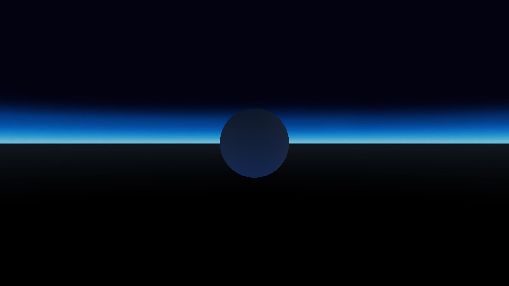
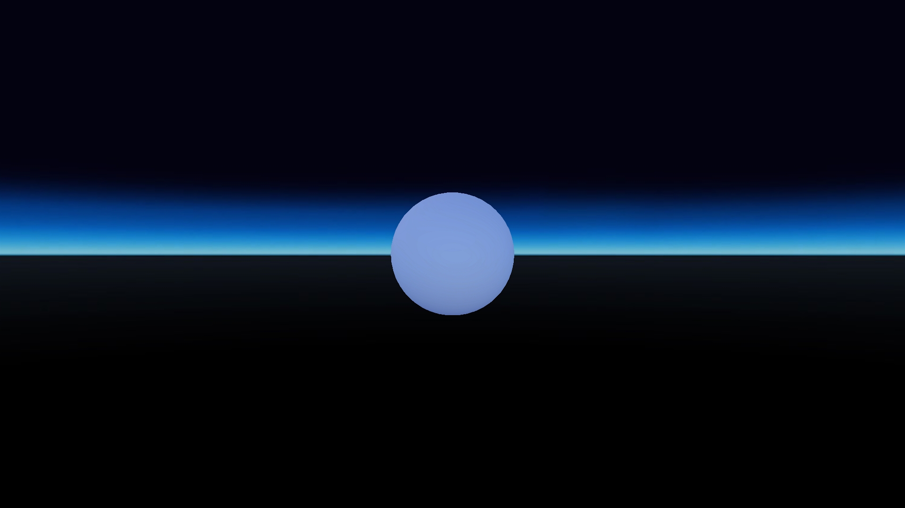

# Zone - Ambient Light Inheritance
## Run this script URL: [Manual](./test.js?raw=true)   [Auto](./testAuto.js?raw=true)(from menu/Edit/Open and Run scripts from URL...).

## Preconditions
- In an empty region of a domain with editing rights.

## Platforms
Run the test on each of the following platforms
 - Windows64
 - MacOS
## Displays
Run the test on each of the following displays
 - Desktop
 - Rift
 - Vive
## Processors
Run the test on each of the following processors
 - I5
 - I7
## Graphics Cards
Run the test on graphics cards from each of the following vendors
 - Nvidia
 - AMD
## Steps
Press space bar to advance step by step

### Step 0
- Red zone, bright ambient light
- 
### Step 1
- Green zone, medium ambient light
- 
### Step 2
- Blue zone, dark ambient light
- 
### Step 3
- Blue off,  no ambient light
- 
### Step 4
- Blue inherit, medium ambient light
- 
### Step 5
- Green off,  no ambient light
- 
### Step 6
- Green inherit, bright ambient light
- 
### Step 7
- Red off,  no ambient light
- 
### Step 8
- Green zone, still no ambient light
- 
### Step 9
- Red on, bright ambient light
- 
### Step 10
- Delete entities
- 
