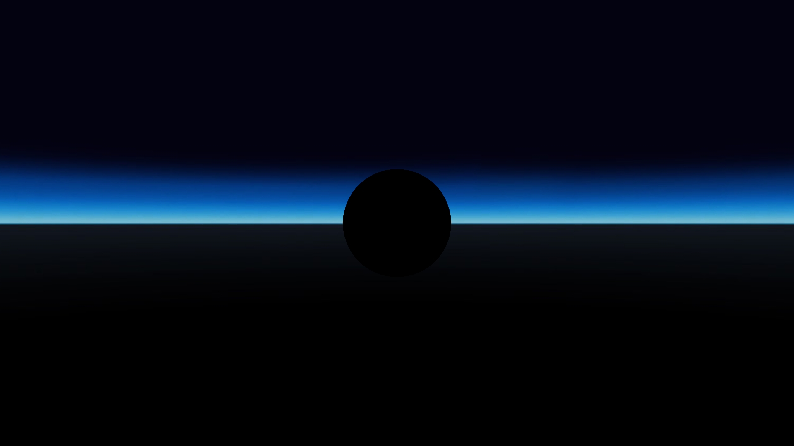

# Zone - Ambient Light Inheritance
## Preconditions
In an empty region of a domain with editing rights.

## Automatic Test
Load script <https://raw.githubusercontent.com/HighFidelity/hifi_tests/master/tests/content/entity/zone/ambientLightInheritance/testAuto.js>

## Manual Test
Load script <https://raw.githubusercontent.com/HighFidelity/hifi_tests/master/tests/content/entity/zone/ambientLightInheritance/test.js>

## Steps
Press space bar to advance step by step

1. Red zone, bright ambient light

2. Green zone, medium ambient light

3. Blue zone, dark ambient light

4. Blue off,  no ambient light

5. Blue inherit, medium ambient light

6. Green off,  no ambient light

7. Green inherit, bright ambient light

8. Red off,  no ambient light

9. Green zone, still no ambient light

10. Red on, bright ambient light

11. Delete entities

