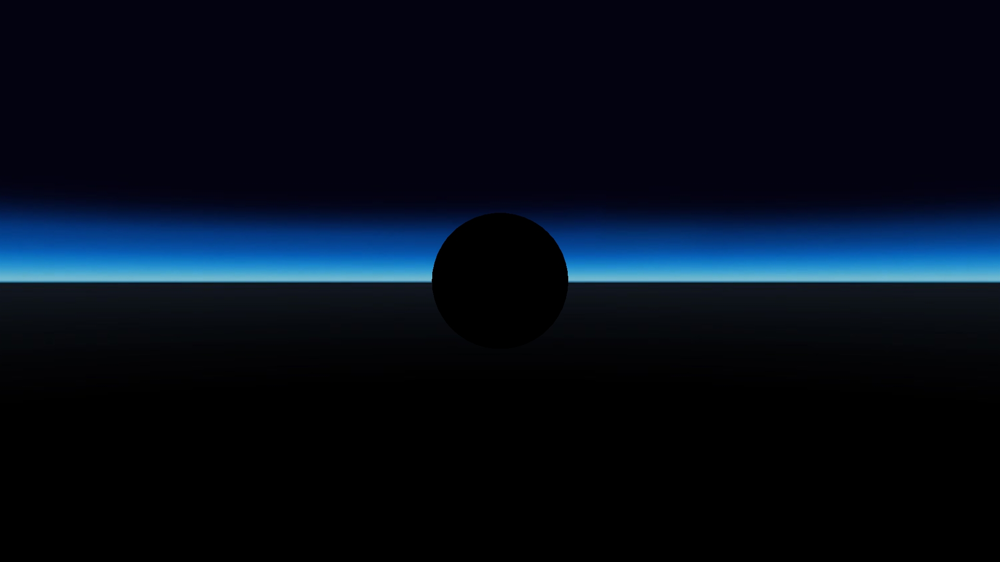

# Zone - Ambient Light Inheritance
## Run this script URL: [Manual](./test.js?raw=true)   [Auto](./testAuto.js?raw=true)(from menu/Edit/Open and Run scripts from URL...).

## Preconditions
- In an empty region of a domain with editing rights.

## Steps
Press 'n' key to advance step by step

### Step 1
- Setup zones and sphere
### Step 2
- Red zone, bright ambient light
- 
### Step 3
- Move to green zone
### Step 4
- Green zone, medium ambient light
- 
### Step 5
- Move to blue zone
### Step 6
- Blue zone, dark ambient light
- 
### Step 7
- Diable ambient light in blue zone
### Step 8
- Blue off,  no ambient light
- 
### Step 9
- Inherit ambient light
### Step 10
- Blue zone, medium ambient light (from green)
- 
### Step 11
- Disable green ambient light
### Step 12
- Green off,  no ambient light
- 
### Step 13
- Set green ambient light to inherit
### Step 14
- Green inherit, bright ambient light (from red)
- 
### Step 15
- Set red ambient light to off
### Step 16
- Red off,  no ambient light
- 
### Step 17
- Move to green zone
### Step 18
- Green zone, still no ambient light
- 
### Step 19
- Set red ambient light to on
### Step 20
- Red on, bright ambient light
- 
### Step 21
- Delete entities
