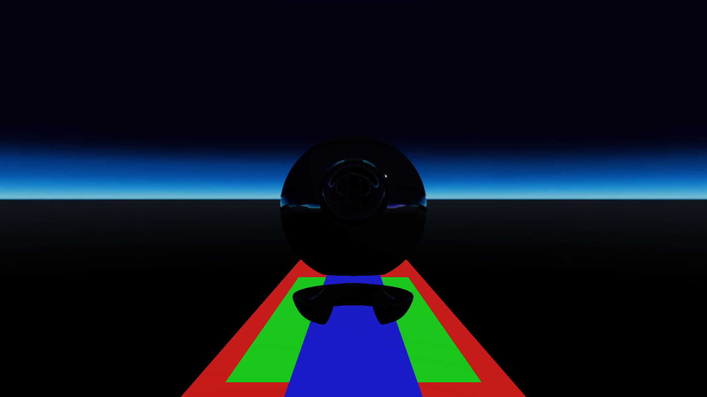
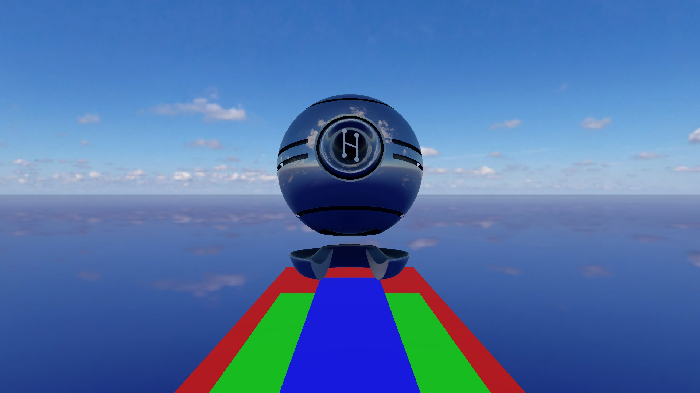
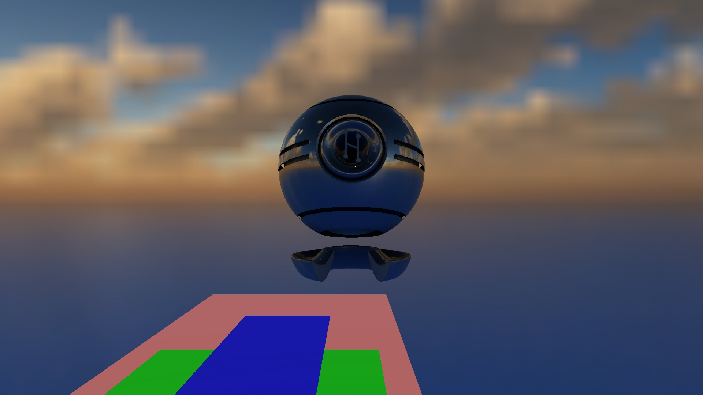
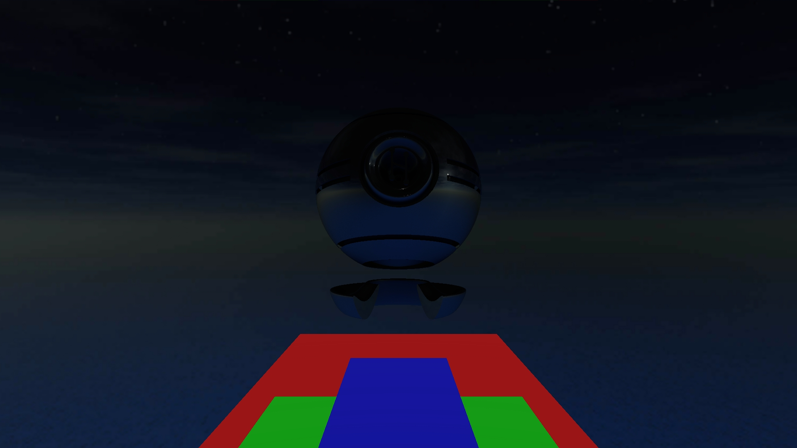

# Zone - Effects on Ambient Lights and Skybox
## Run this script URL: [Manual](./test.js?raw=true)   [Auto](./testAuto.js?raw=true)(from menu/Edit/Open and Run scripts from URL...).

## Preconditions
- In an empty region of a domain with editing rights.

## Steps
Press 'n' key to advance step by step

### Step 1
- Setup object, zones and markers
### Step 2
- Verify no skybox
- 
### Step 3
- Move forward
### Step 4
- Verify bright sky
- 
### Step 5
- Move forward again
### Step 6
- Verify night
- 
### Step 7
- Moving forward and right
### Step 8
- Verify in cloudy zone
- 
### Step 9
- Move left
### Step 10
- Verify in dark zone
- 
### Step 11
- Cleanup
