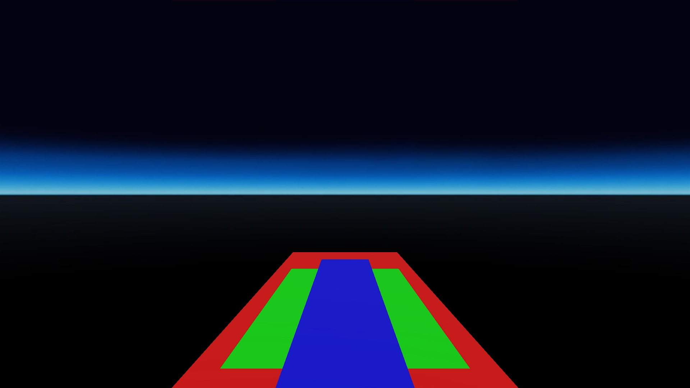
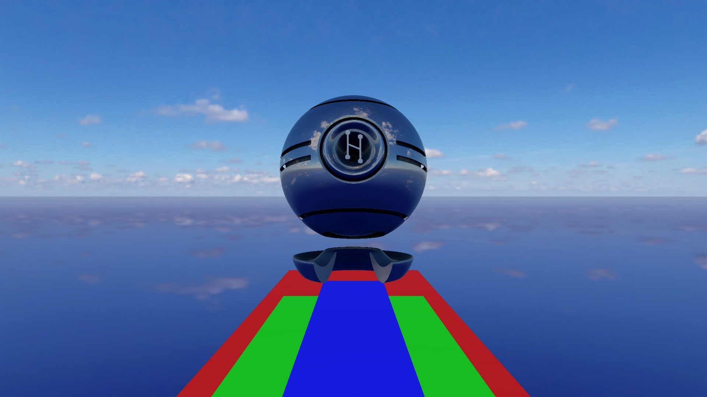

# Ambient Light Zone Effects
## General

The tests consist of setting zone component parameters and moving through the zones.
The zones are as in the following image:

## Preconditions
In an empty region of a domain with editing rights.

## Automatic Test
Load script <https://raw.githubusercontent.com/NissimHadar/hifi_tests/addRecursionToAutotester/tests/content/entity/zone/ambientLightZoneEffects/testAuto.js>
## Manual Test
Load script <https://raw.githubusercontent.com/NissimHadar/hifi_tests/addRecursionToAutotester/tests/content/entity/zone/ambientLightZoneEffects/test.js>

Press space bar to advance step by step:
1.  First image is just the zones
 
2. Move forward into red zone (point A - bright sky)
 
3. Move forward into blue zone (point B - night sky)

4. Move forward and right into green zone (point C - cloudy sky)
 
5. Move left into blue zone (point D - night sky)
 
