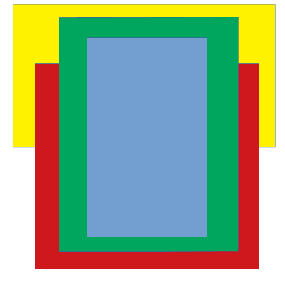

# Entity Zone Create
## General
This test will build the following zone hierarchy:

 

The tests consist of setting zone component parameters and moving through the zones.

### Preconditions
In an empty region of a domain with editing rights

### Steps

#### Step 1
- run this [script URL](./create.js?raw=true) (from menu/Edit/Open and Run scripts From URL...). 
- expected 
  - A new zone entity called "test create zone" centered on my avatar position, a box of 5 meters side length
  - The keylight color is turned to green and the background is activated and blue
  - The world axis aligned bounding box of the zone is visible
  - The zone stack tool is enabled and represent the newly created zone's key light (green) and background (blue) before the default zone graphics components

 
