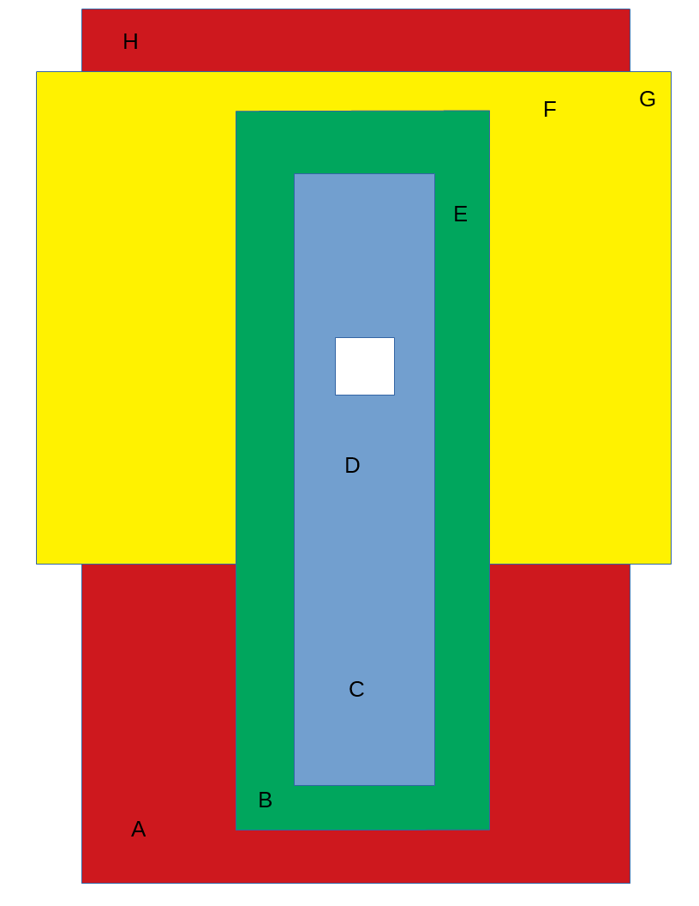

# Entity Zone Inheritance
## General
This test will build the following zone hierarchy:

 

The tests consist of setting zone component parameters and moving through the zones.

## Preconditions
Run interface and delete all content

## Steps

### Step 1
- run this [script URL](./create.js?raw=true) (from menu: Edit->Open and Run Script File...). 
- expected 
  - A 1000m x 1000m flat terrain
  - 4 areas are defined on the terrain.  Each area corresponds with a matching zone; the zones are all 10 m high.
  
### Step 2
This part consists of stepping through 8 positions and verifying the colour of the keylight.  This can be seen by moving back from the avatar and observing its head.

1. Run [script URL](./A.js?raw=true)
   * Keylight is red  
1. Run [script URL](./B.js?raw=true)
   * Keylight is green  
1. Run [script URL](./C.js?raw=true)
   * Keylight is blue  
1. Run [script URL](./D.js?raw=true)
   * Keylight is blue  
1. Run [script URL](./E.js?raw=true)
   * Keylight is green  
1. Run [script URL](./F.js?raw=true)
   * Keylight is yellow  
1. Run [script URL](./G.js?raw=true)
   * Keylight is yellow  
1. Run [script URL](./H.js?raw=true)
   * Keylight is red  

