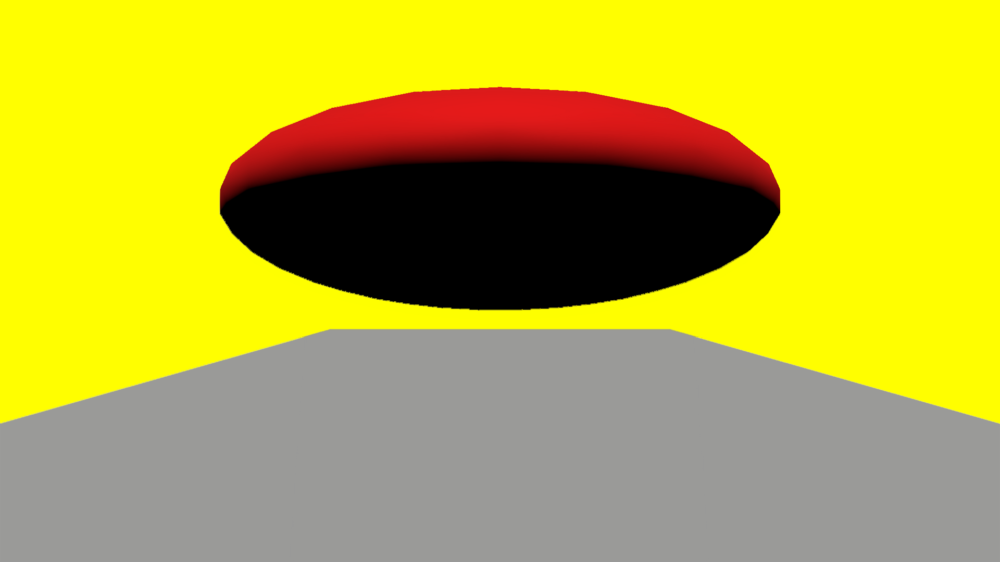
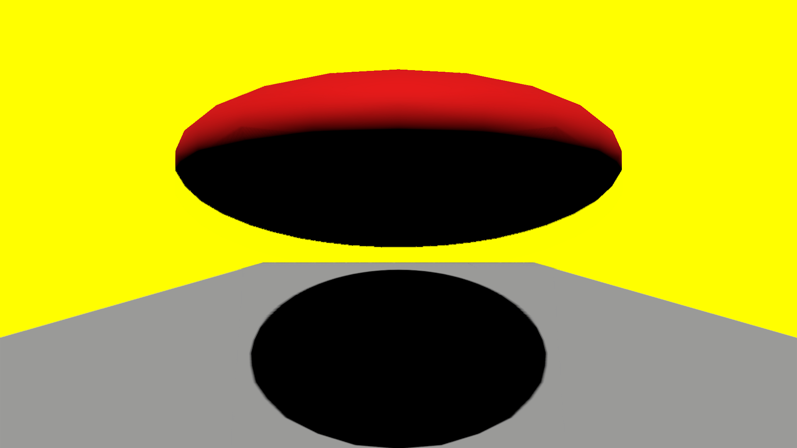
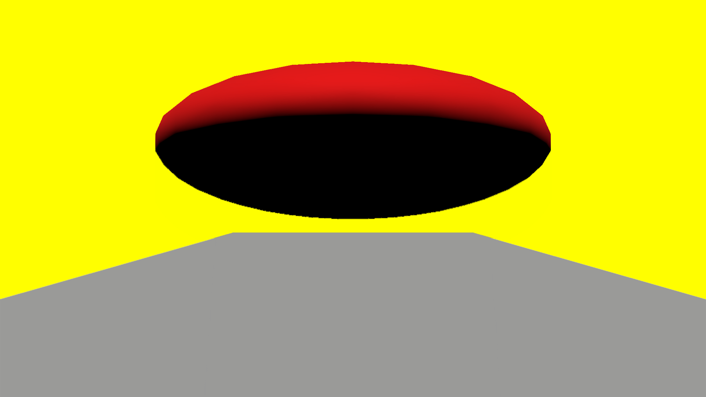
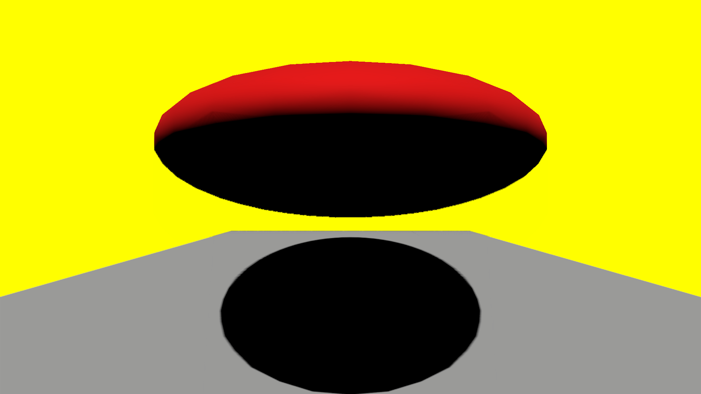

# Shadow control
## Run this script URL: [Manual](./test.js?raw=true)   [Auto](./testAuto.js?raw=true)(from menu/Edit/Open and Run scripts from URL...).

## Preconditions
- In an empty region of a domain with editing rights.

## Steps
Press 'n' key to advance step by step

### Step 1
- Create zone and add objects
### Step 2
- No shadows
- 
### Step 3
- Let zone show shadows
### Step 4
- Shadow is visible
- 
### Step 5
- Disable casting of shadow by sphere
### Step 6
- Shadow is not visible
- 
### Step 7
- Disable casting of shadows by renderer
### Step 8
- Shadow is not visible
- 
### Step 9
- Re-enable casting of shadows by renderer
### Step 10
- Shadow is visible
- 
### Step 11
- Clean up after test
