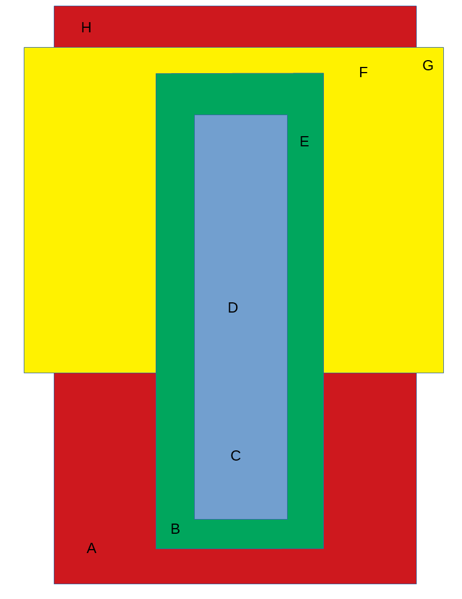
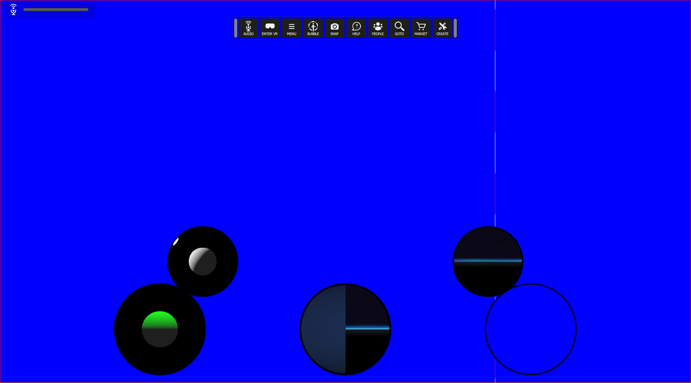

# Entity Zone Inheritance
## General
This test will build the following zone hierarchy:

 

The tests consist of stepping through the zones.  They are setup as follows:
* Red - Sunny blue sky with some clouds
* Green - Winter sky with lots of clouds (think Seattle)
* Yellow - yellow background
* Blue - Blue background

## Preconditions
Run interface and delete all content

## Steps

### Step 1
- run this [script URL](./create.js?raw=true) (from menu: Edit->Open and Run Script File...). 
- expected 
  - A 1000m x 1000m flat terrain
  - 4 areas are defined on the terrain.  Each area corresponds with a matching zone; the zones are all 10 m high.
  
### Step 2
This part consists of stepping through 8 positions and verifying the colour of the keylight.  This can be seen by moving back from the avatar and observing its head.

1. Run [script URL](./A.js?raw=true)
   * A bright blue sky with some clouds is visible
1. Run [script URL](./B.js?raw=true)
   * A miserable grey sky is visible.
1. Run [script URL](./C.js?raw=true)
   * The sky is solid blue
1. Run [script URL](./D.js?raw=true)
   * The sky remains solid blue
1. Run [script URL](./E.js?raw=true)
   * A miserable grey sky is visible.
1. Run [script URL](./F.js?raw=true)
   * The sky is solid yellow
1. Run [script URL](./G.js?raw=true)
   * The sky remains solid yellow 
1. Run [script URL](./H.js?raw=true)
   * A bright blue sky with some clouds is visible 

