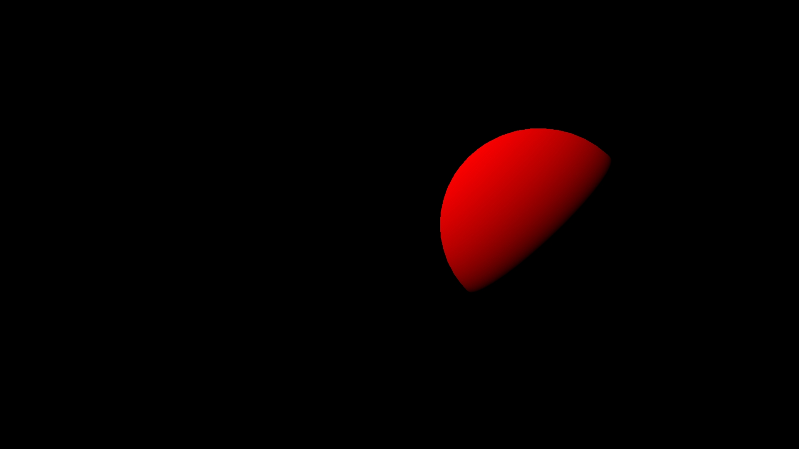
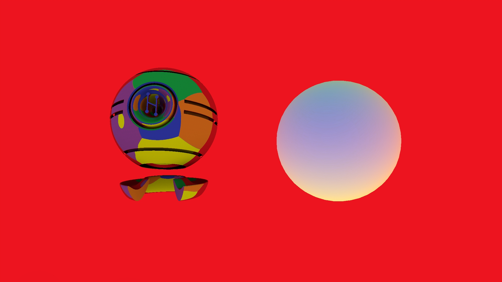

# zone - ambient light inheritance
## Run this script URL: [Manual](./test.js?raw=true)   [Auto](./testAuto.js?raw=true)(from menu/Edit/Open and Run scripts from URL...).

## Preconditions
- In an empty region of a domain with editing rights.

## Steps
Press space bar to advance step by step

### Step 1
- Zone not rotated - keylight at zenith
- 
### Step 2
- Pitch zone 45 degrees up, light should come from behind, 45 degrees above horizon
- 
### Step 3
- Add yaw zone 90 degrees clockwise, light should come from left, 45 degrees above horizon
- 
### Step 4
- Add roll zone 45 degrees clockwise, light should come from left
- 
### Step 5
- Zone not rotated - sun straight ahead on purple background (sphere is hidden)
- 
### Step 6
- Yaw zone 15 degrees right, sun should move right
- 
### Step 7
- Pitch zone 15 degrees up, yaw zone 15 degrees right, sun should move right and up
- 
### Step 8
- Pitch zone 15 degrees up, yaw zone 15 degrees right and roll 45 degrees, sun should move straight up
- 
### Step 9
- Zone not rotated - diffuse sphere and metallic object visible (skybox still enabled as a visual aid)
- 
### Step 10
- Yaw 90 degrees - blue is now behind
- 
### Step 11
- Yaw 180 degrees - purple is now behind
- 
### Step 12
- Yaw 270 degrees - red is now behind
- 
### Step 13
- Pitch 90 - green is now behind
- 
### Step 14
- Roll 45 degrees - green top-left, red top-right, yellow bottom-right, blue bottom-left
- 
