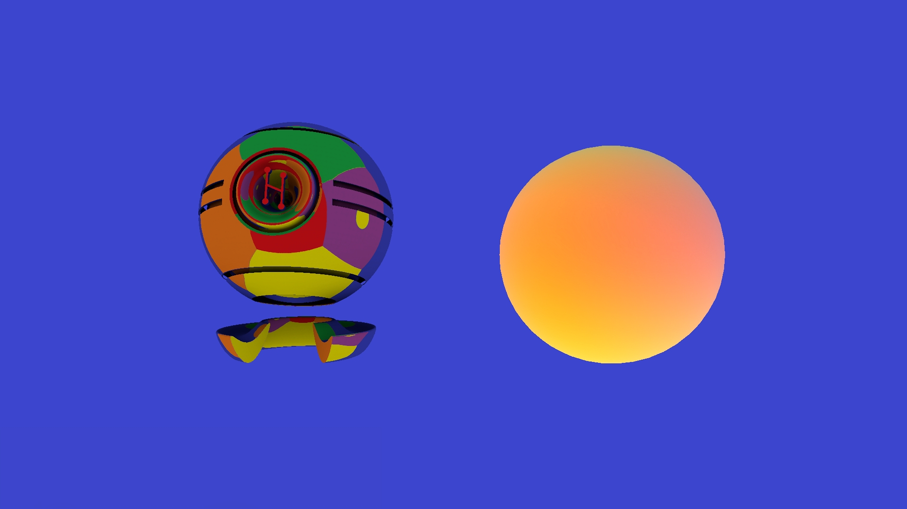

# Zone Orientation Effects
## General
This test verifies the effects of zone orientation on  the keylight, ambient light and the skybox.

 

The tests consist of setting keylight component parameters and moving through the zones.  In each zone, the keylight modes are changed.

## Preconditions
In an empty region of a domain with editing rights
## Automatic Test
Load script <https://raw.githubusercontent.com/NissimHadar/hifi_tests/addRecursionToAutotester/tests/content/entity/zone/zoneOrientation/testAuto.js>
## Manual Test
Load script <https://raw.githubusercontent.com/NissimHadar/hifi_tests/addRecursionToAutotester/tests/content/entity/zone/zoneOrientation/test.js>

Press space bar to advance step by step:
1.  KEYLIGHT TESTS - Zone not rotated - keylight at zenith

Press space bar to advance step by step:
1.  Pitch zone 45 degrees up, light should come from behind, 45 degrees above horizon
 
1. Add yaw zone 90 degrees clockwise, light should come from left, 45 degrees above horizon
 
1. Add roll zone 45 degrees clockwise, light should come from left
 
1. SKYBOX TESTS - Zone not rotated - sun straight ahead on purple background (sphere is hidden)

1. Yaw zone 15 degrees right, sun should move right

1. Pitch zone 15 degrees up, yaw zone 15 degrees right, sun should move right and up

1. Pitch zone 15 degrees up, yaw zone 15 degrees right and roll 45 degrees, sun should move straight up

1. AMBIENT LIGHT TESTS - Zone not rotated - diffuse sphere and metallic object visible (skybox still enabled as a visual aid)

1. Yaw 90 degrees - blue is now behind

1. Yaw 180 degrees - purple is now behind

1. Yaw 270 degrees - red is now behind

1. Pitch 90 - green is now behind

1. Roll 45 degrees - green top-left, red top-right, yellow bottom-right, blue bottom-left
