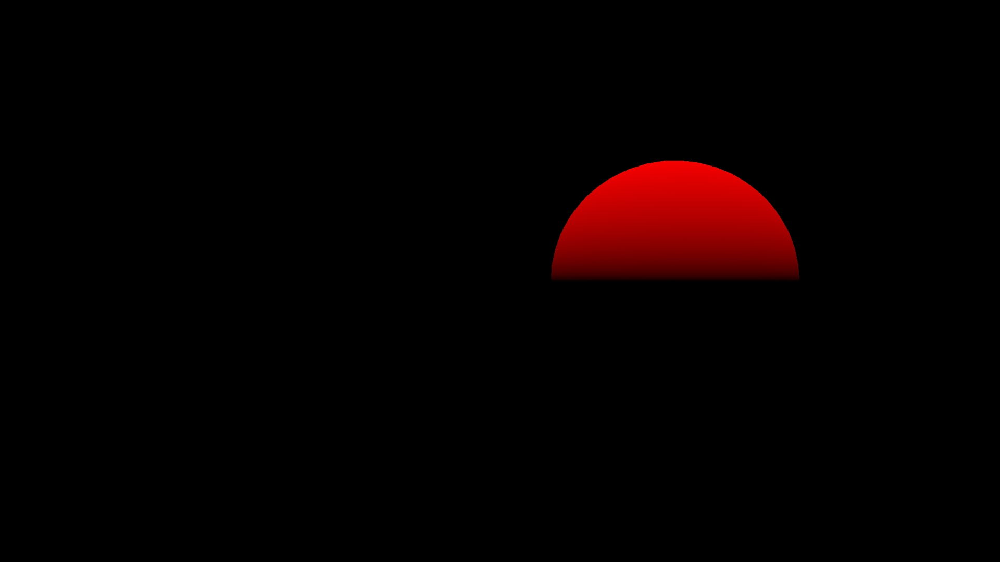
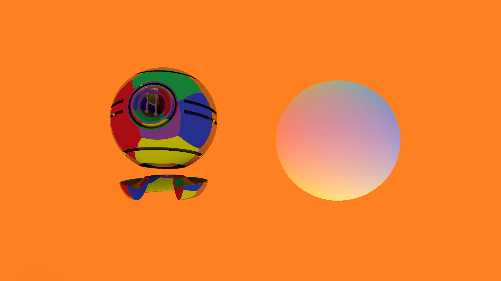
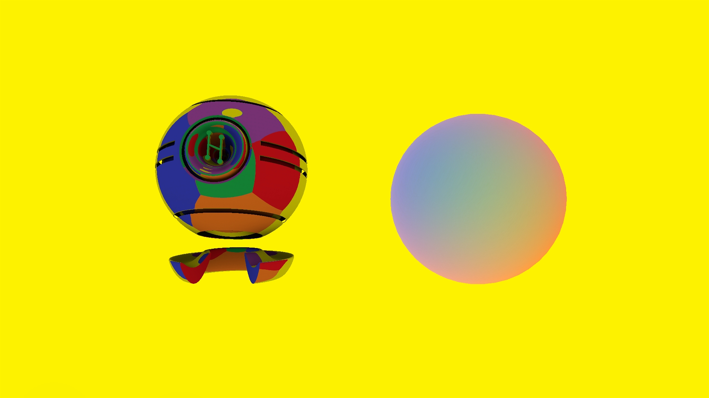

# Zone - effects of orientation
## Run this script URL: [Manual](./test.js?raw=true)   [Auto](./testAuto.js?raw=true)(from menu/Edit/Open and Run scripts from URL...).

## Preconditions
- In an empty region of a domain with editing rights.

## Steps
Press 'n' key to advance step by step

### Step 1
- Zone not rotated - keylight at zenith
- 
### Step 2
- Pitch zone 45 degrees up
### Step 3
- Light should come from behind, 45 degrees above horizon
- 
### Step 4
- Add yaw zone 90 degrees clockwise
### Step 5
- Light should come from left, 45 degrees above horizon
- 
### Step 6
- Add roll zone 45 degrees clockwise
### Step 7
- Light should come from left
- 
### Step 8
- Clear zone rotation
### Step 9
- Sun straight ahead on purple background (sphere is hidden)
- 
### Step 10
- Yaw zone 15 degrees right
### Step 11
- Sun should move right
- 
### Step 12
- Pitch zone 15 degrees up and yaw zone 15 degrees right
### Step 13
- Sun should move right and up
- 
### Step 14
- Pitch zone 15 degrees up, yaw zone 15 degrees right and roll 45 degrees
### Step 15
- Sun should move straight up
- 
### Step 16
- Zone not rotated
### Step 17
- Diffuse sphere and metallic object visible (skybox still enabled as a visual aid)
- 
### Step 18
- Yaw to 90 degrees
### Step 19
- Blue is now behind
- 
### Step 20
- Yaw to 180 degrees
### Step 21
- Purple is now behind
- 
### Step 22
- Yaw to 270 degrees
### Step 23
- Red is now behind
- 
### Step 24
- Pitch 90
### Step 25
- Green is now behind
- 
### Step 26
- Roll 45 degrees
### Step 27
- Green top-left, red top-right, yellow bottom-right, blue bottom-left
- 
### Step 28
- Cleanup
