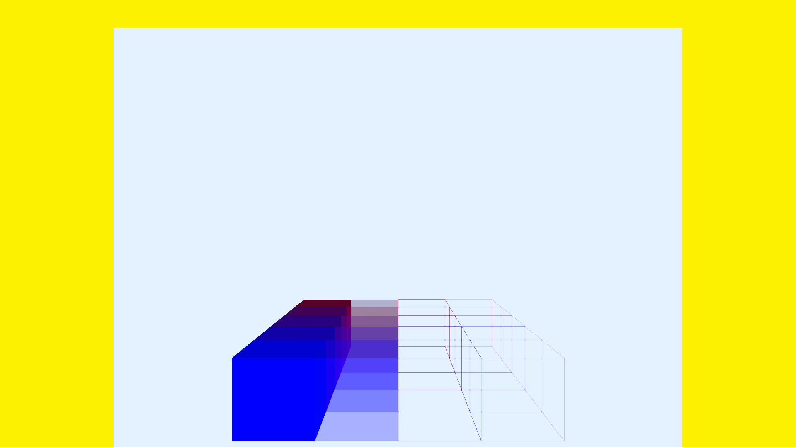

# Shape Overlay Draw in Front
## Run this script URL: [Manual](./test.js?raw=true)   [Auto](./testAuto.js?raw=true)(from menu/Edit/Open and Run scripts from URL...).

## Preconditions
- In an empty region of a domain with editing rights.

## Steps
Press 'n' key to advance step by step

### Step 1
- Turn off TAA for this test
### Step 2
- Create a zone
### Step 3
- Create drawInFront shape overlays
### Step 4
- Take snapshot of all the models
- 
### Step 5
- Clean up after test
