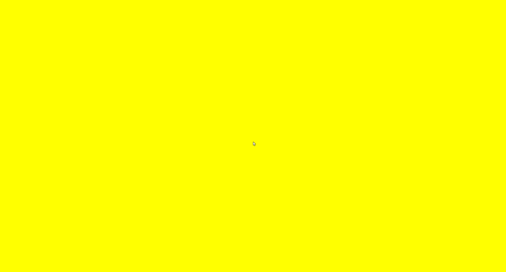
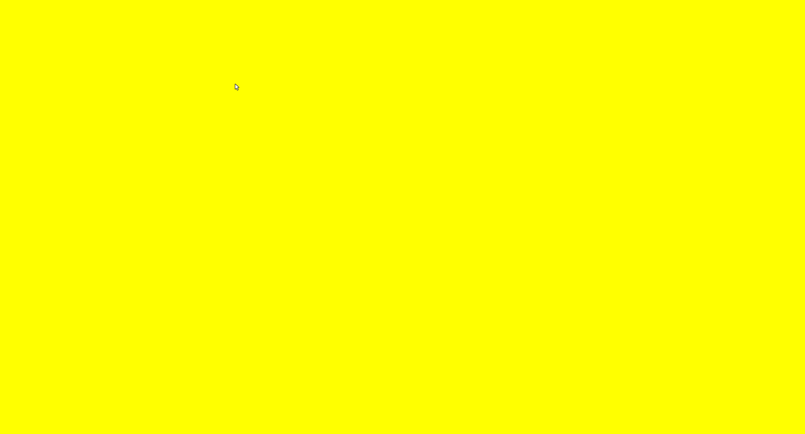

# Reticle control
## Run this script URL: [Manual](./test.js?raw=true)   [Auto](./testAuto.js?raw=true)(from menu/Edit/Open and Run scripts from URL...).

## Preconditions
- In an empty region of a domain with editing rights.

## Steps
Press 'n' key to advance step by step

### Step 1
- Show reticle and position in fixed location
### Step 2
- Default reticle in centre of screen
- 
### Step 3
- Set scaling to 50 (for large cursor)
### Step 4
- Large cursor
- 
### Step 5
- Move cursor to right
### Step 6
- Reticle should have moved to the right
- 
### Step 7
- Move cursor up
### Step 8
- Reticle should have moved up
- 
### Step 9
- Hide reticle
### Step 10
- No reticle should be displayed
- 
### Step 11
- Show reticle
### Step 12
- Normal reticle should be displayed
- 
### Step 13
- Cleanup
