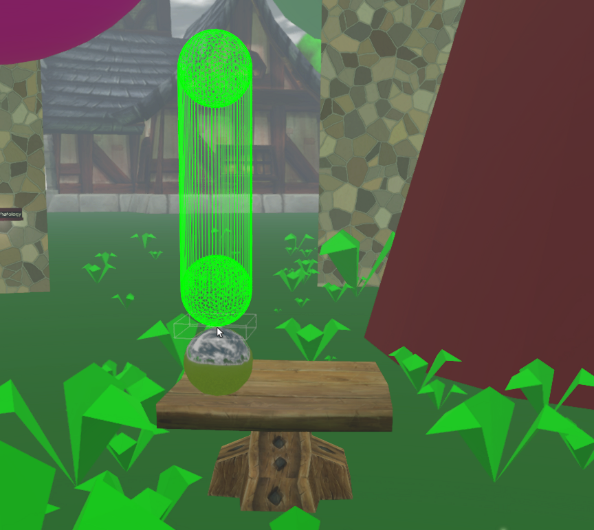
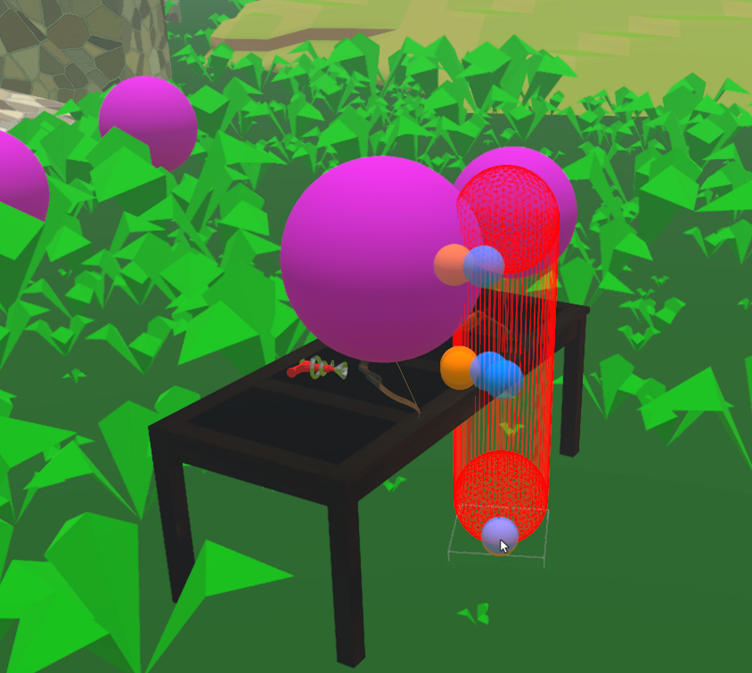

# Test capsule CollisionPick on server
## Run this script URL: [Manual](./test.js?raw=true)

## Preconditions
- In a complicated test domain such as engine-dev
- Physics engine is loaded
- In HMD mode with keyboard available

### Step 1
- Enable developer statistics by going into the menu and selecting Developer -> Show Statistics. "Click" on the statistics overlay so that more information is displayed.
- In total, prepare to record the following measurements during this test:
    - "Original value" (ms)
    - 3 measurements of "Non-colliding capsule" (ms)
    - "Static mesh colliding capsule" (ms)
    - "Value after cleanup" (ms)
- Choose and remember a position and orientation for the avatar where the ground is relatively flat and the environment is not changing, and hold the HMD controllers in a downward facing resting position. In the left panel of developer statistics, record the value of game time in milliseconds spent by pickManager as "original value" (ms). The avatar position and orientation, and pointing directions of the controllers, will be used to ensure a reliable comparison reading at the end of the test.
### Step 2
- Press 'n' key to advance the script. The script will now visualize the capsule pick without collision points.
- You should see a capsule-shaped wire overlay which follows where you point. Green indicates no collision and red indicates collision. The capsule is also allowed to be red when close to some objects but not touching. (This behavior will be improved in the future.) However, if the capsule is green while colliding with an object, that is considered a failure. The capsule is considered colliding with an object when its wireframe overlaps with the object's collision mesh. Collision meshes can be visualized by temporarily enabling Developer -> Physics -> Show Bullet Collision.
- 
- In HMD mode, the capsule overlay should rotate in response to controller movement. Verify that the capsule is red when colliding with things, regardless of its rotation and which part of the capsule collides.
- Find and maintain a position and orientation of the capsule so that the capsule is green. From the same left panel of the extended developer statistics, record the value of game time in milliseconds spent by pickManager once the value has stabilized as "Non-colliding capsule" (ms). Record this value in two other areas of the domain where the capsule is green.
- Enable Developer -> Physics -> Show Bullet Collision to find an object with a complicated mesh. Once you have found a complicated mesh, disable the "Show Bullet Collision" setting and move the capsule so that it collides with the object with the complicated mesh as much as possible. From the same statistics panel, read off the value of time spent by pickManager once the value has stabilized and record it as "Static mesh colliding capsule" (ms).
### Step 3
- Press 'n' key to advance the script. The script will now visualize the capsule pick with collision points.
- Expect temporary script unresponsiveness when interacting with objects with complicated collision meshes. This is a known issue with the contact point visualization in the script. Contact points are still calculated on the C++ side in both steps.
- You should see the same overlay as before, but with additional blue and orange spheres which represent contact points within the pick and the intersected objects.
- 
- In HMD mode, the capsule overlay should rotate in response to controller movement. Verify that the contact points are around the vicinity of the capsule while the capsule is rotated.
### Step 4
- Press 'n' key to advance the script to completion. This will clean up the test.
- Return the avatar to the position, orientation, and resting controller position used to record "original value" at the beginning of the test. From the statistics panel, read off the time spent by pickManager once the value has stabilized and record it as "Value after cleanup" (ms). There should be no more than a 15% difference from "original value".