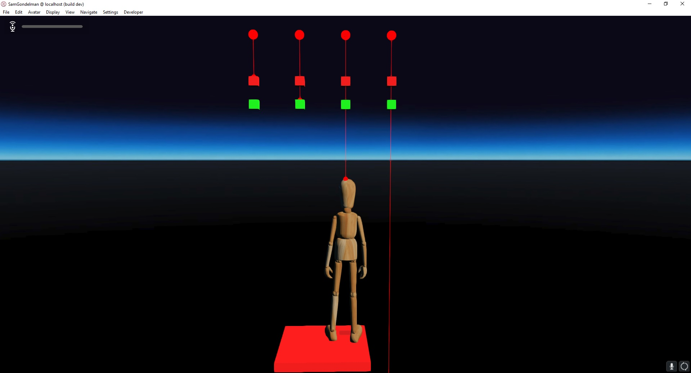
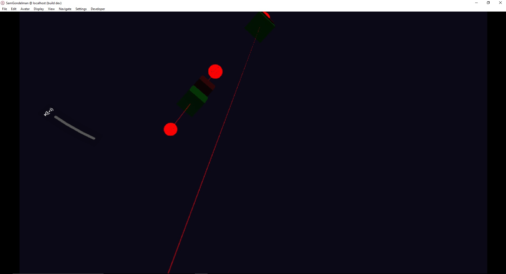

# Laser Pointers

### Preconditions
Interface is running in an empty domain where you have edit rights.  Wear the default wooden mannequin avatar.

### Steps

#### Step 1
- Run the [collision.js script](./testStory.js?raw=true) (from Menu/Edit/Open and Run scripts From URL...).  Zoom out.
- Expected: 

#### Step 2
- Enter HMD mode and look up.  You should see the fourth laser hitting your HUD sphere.
- Expected: 