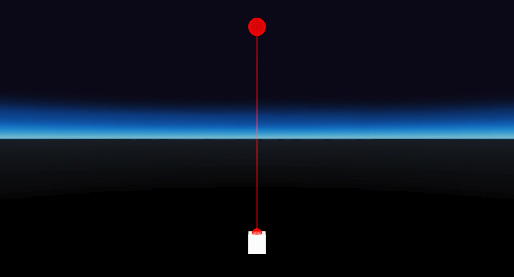

# Size of laser end increases with distance
## Run this script URL: [Manual](https://raw.githubusercontent.com/highfidelity/hifi_tests/master/tests/engine/interaction/pointer/laser/distanceScaleEnd/test.js)   [Auto](https://raw.githubusercontent.com/highfidelity/hifi_tests/master/tests/engine/interaction/pointer/laser/distanceScaleEnd/testAuto.js)(from menu/Edit/Open and Run scripts from URL...).

## Preconditions
- In an empty region of a domain with editing rights.

## Steps
Press 'n' key to advance step by step

### Step 1
- Move back to see the objects
### Step 2
- Minimum distance
- 
### Step 3
- Mid distance
- 
### Step 4
- Maximum distance
- 
### Step 5
- Clean up
