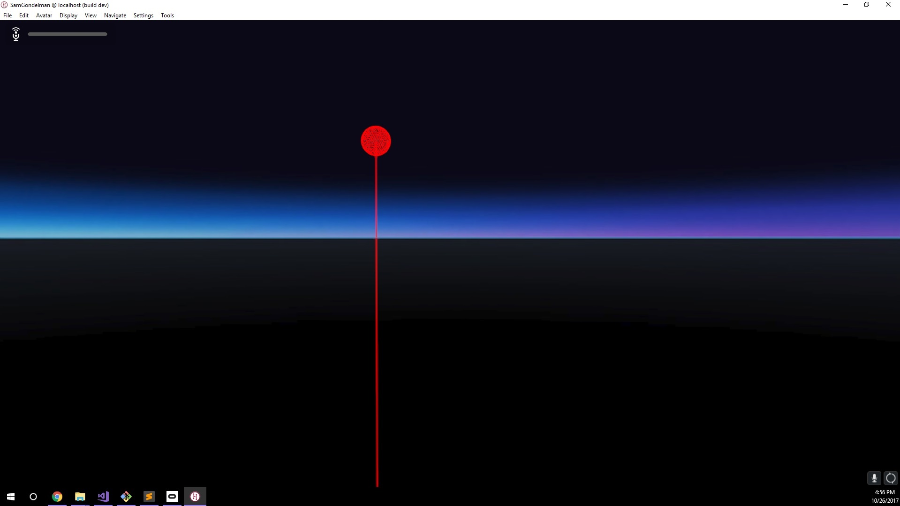
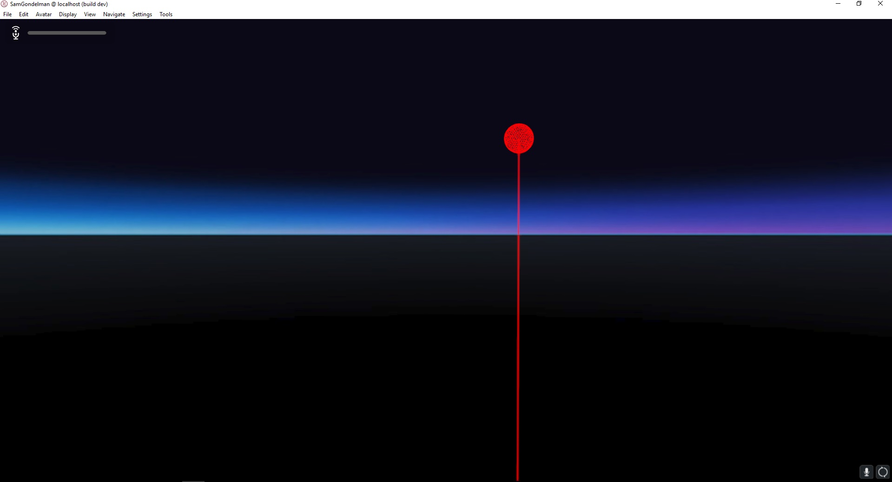

# Laser Pointers

### Preconditions
Interface is running in an empty domain

### Steps

#### Step 1
- Run the [enable.js script](./enable.js?raw=true) (from Menu/Edit/Open and Run scripts From URL...).  It creates two static laser pointers, one enabled and one disabled
- Expected: 

#### Step 2
- Press [SPACE].  The lasers will toggle their enabled flag.
- Expected: 

#### Step 3
- Repeatedly press [SPACE].
- Expected: The pointers should alternate every time.