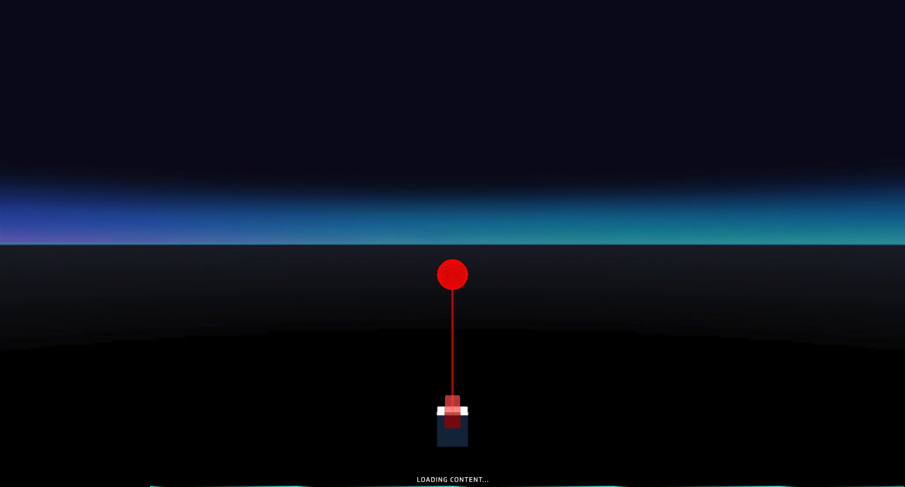
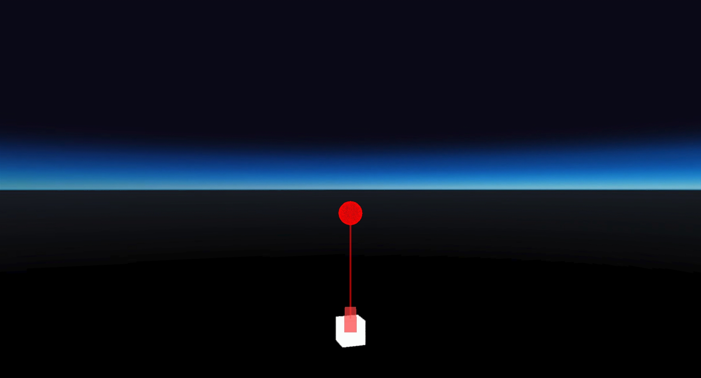
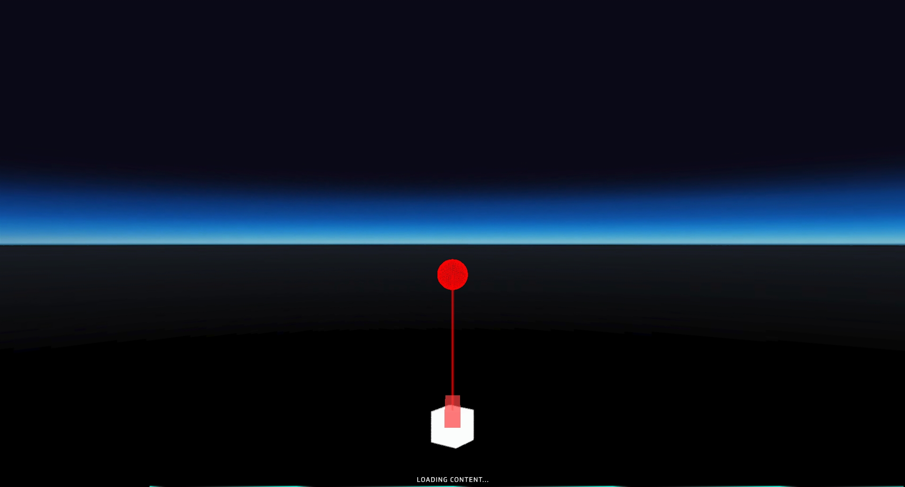

# LaserPointer faceAvatar test
## Run this script URL: [Manual](https://raw.githubusercontent.com/highfidelity/hifi_tests/master/tests/engine/interaction/pointer/laser/faceAvatar/test.js)   [Auto](https://raw.githubusercontent.com/highfidelity/hifi_tests/master/tests/engine/interaction/pointer/laser/faceAvatar/testAuto.js)(from menu/Edit/Open and Run scripts from URL...).

## Preconditions
- In an empty region of a domain with editing rights.

## Steps
Press 'n' key to advance step by step

### Step 1
- Set camera to first person mode
### Step 2
- Move to 1st position
### Step 3
- 1st position
- 
### Step 4
- Move to 2nd position
### Step 5
- 2nd position
- 
### Step 6
- Move to 3rd position
### Step 7
- 3rd position
- 
### Step 8
- Move to 4th position
### Step 9
- 4th position
- 
### Step 10
- Move to 5th position
### Step 11
- 5th position
- 
### Step 12
- Clean up after test
