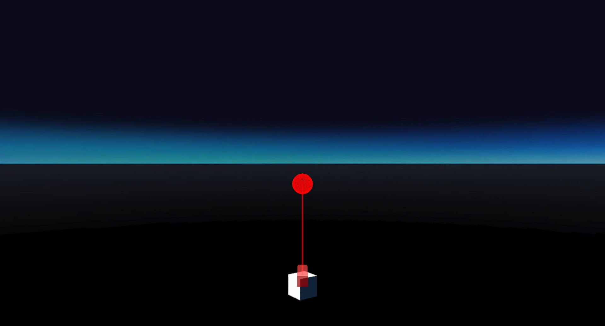
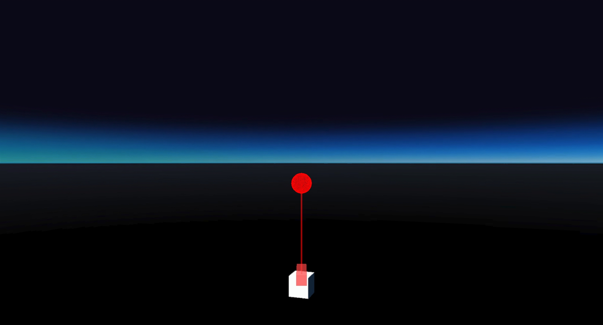

# LaserPointer faceAvatar test
## Run this script URL: [Manual](./test.js?raw=true)   [Auto](./testAuto.js?raw=true)(from menu/Edit/Open and Run scripts from URL...).

## Preconditions
- In an empty region of a domain with editing rights.

## Steps
Press 'n' key to advance step by step

### Step 1
- 1st position
- 
### Step 2
- 2nd position
- 
### Step 3
- 3rd position
- 
### Step 4
- 4th position
- 
### Step 5
- Clean up after test
