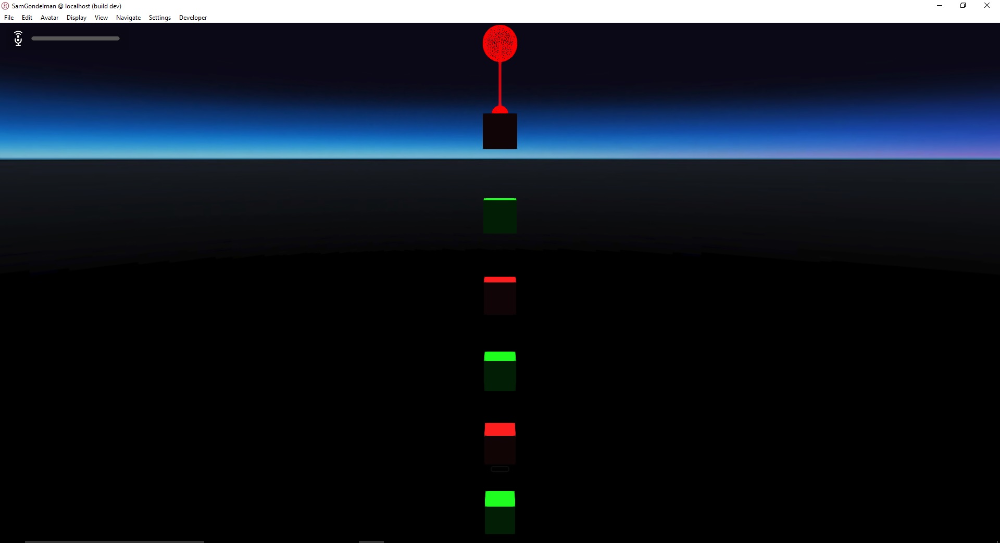
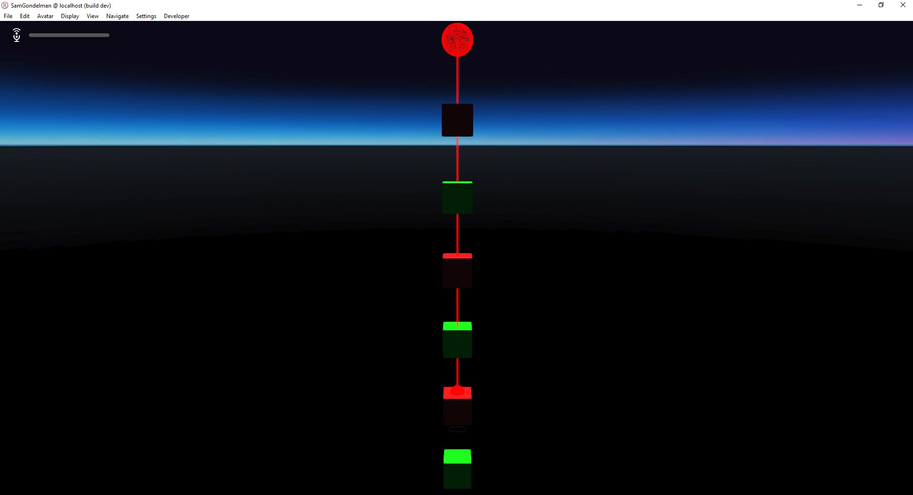
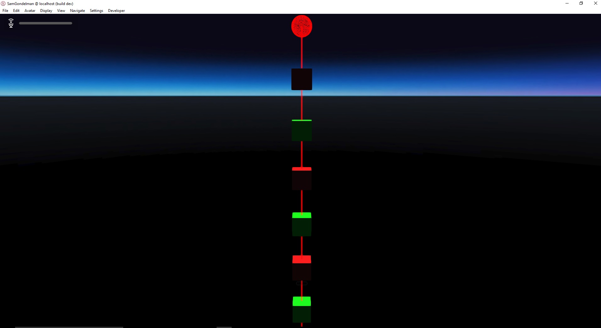
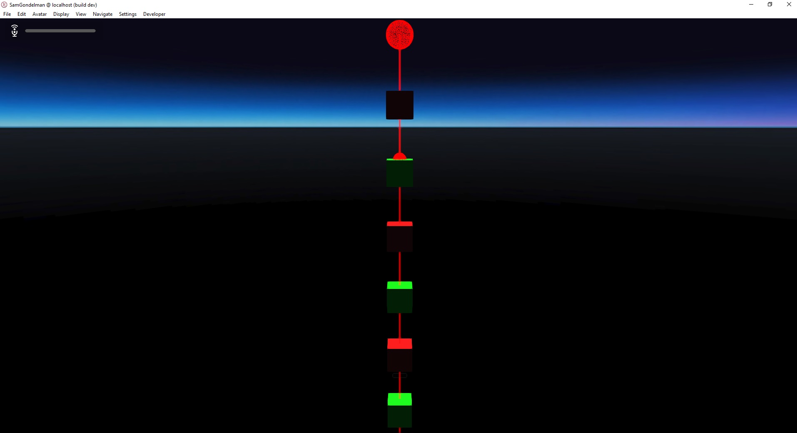

# Laser Pointers

### Preconditions
Interface is running in an empty domain where you have edit rights.

### Steps

#### Step 1
- Run the [ignore.js script](./ignore.js?raw=true) (from Menu/Edit/Open and Run scripts From URL...).
- Expected: 

#### Step 2
- Press [SPACE] to move through the steps.
- Expected:

#### Step 3
- The steps will repeat, so if you need to test threading or repeated changes, you can hold [SPACE] to loop through them constantly.
- Expected: no crashes, pattern repeats consistently