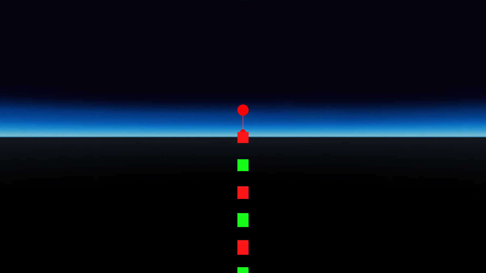
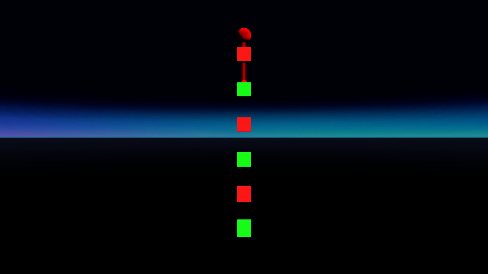
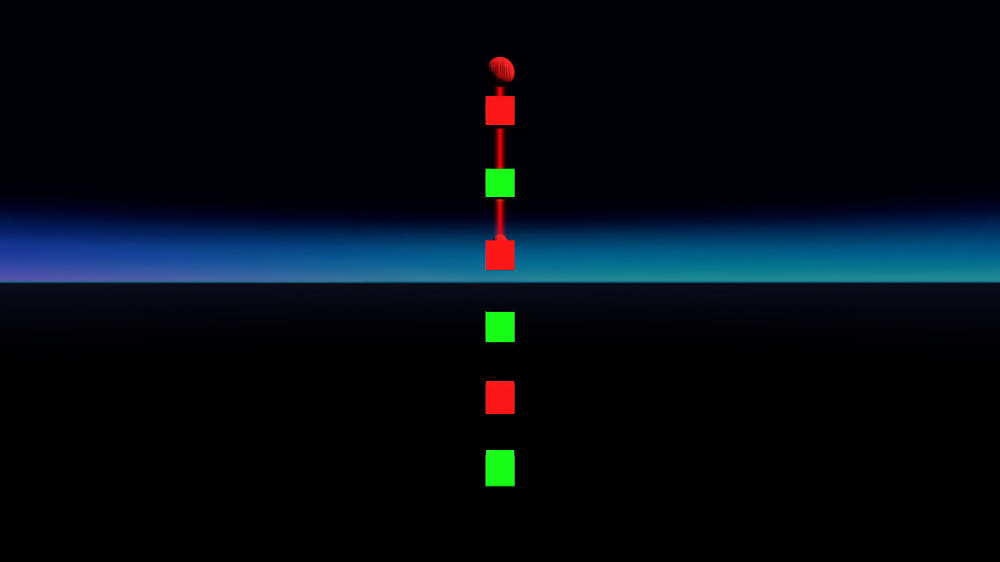
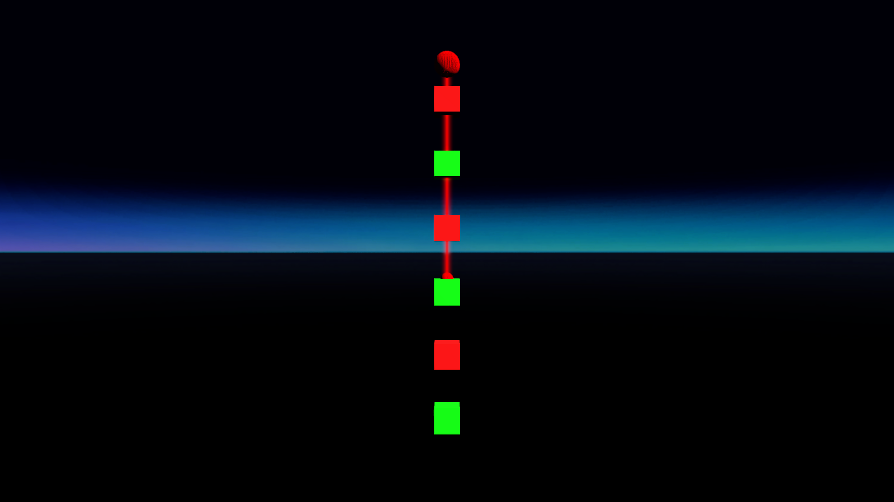
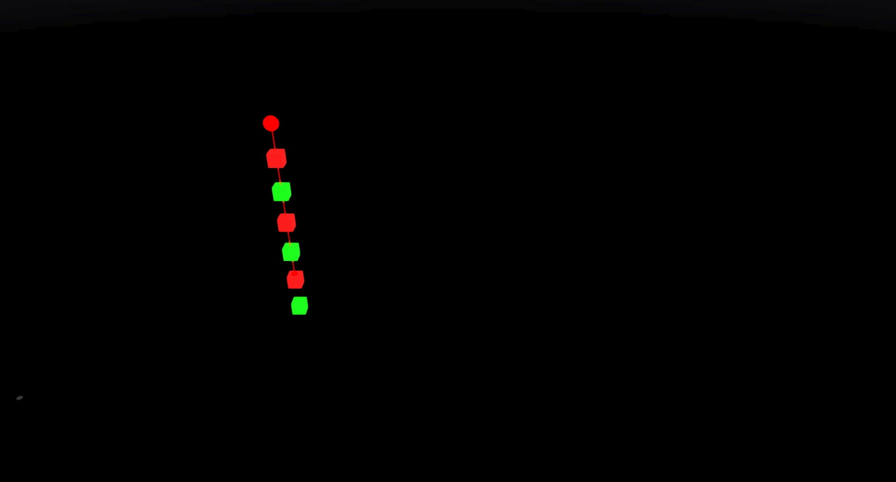
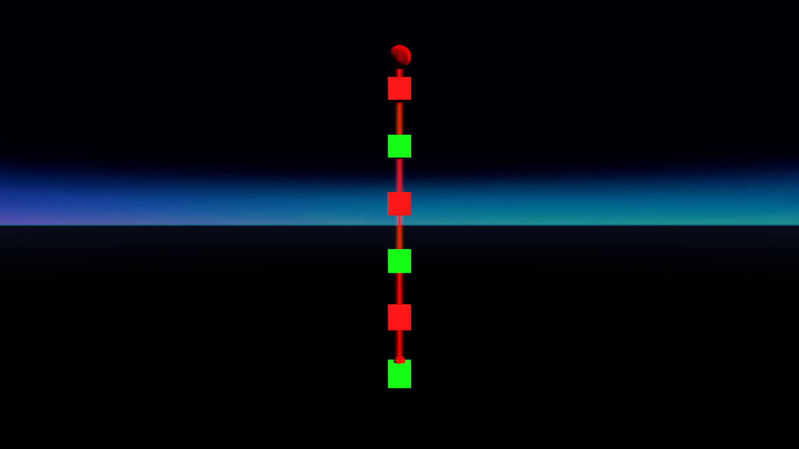
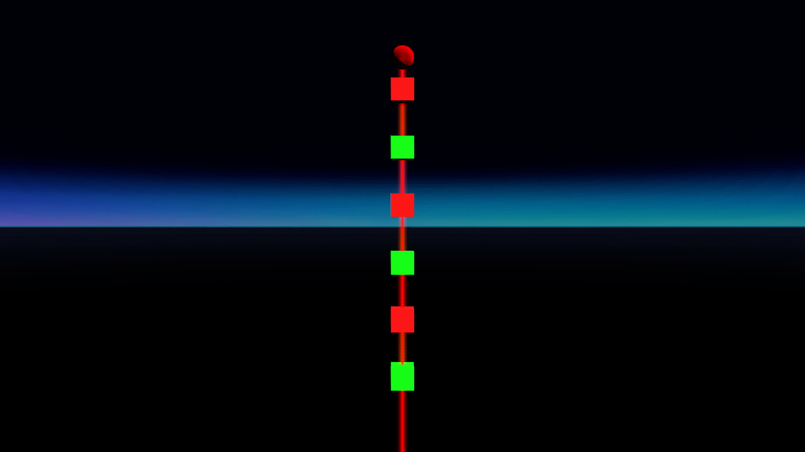
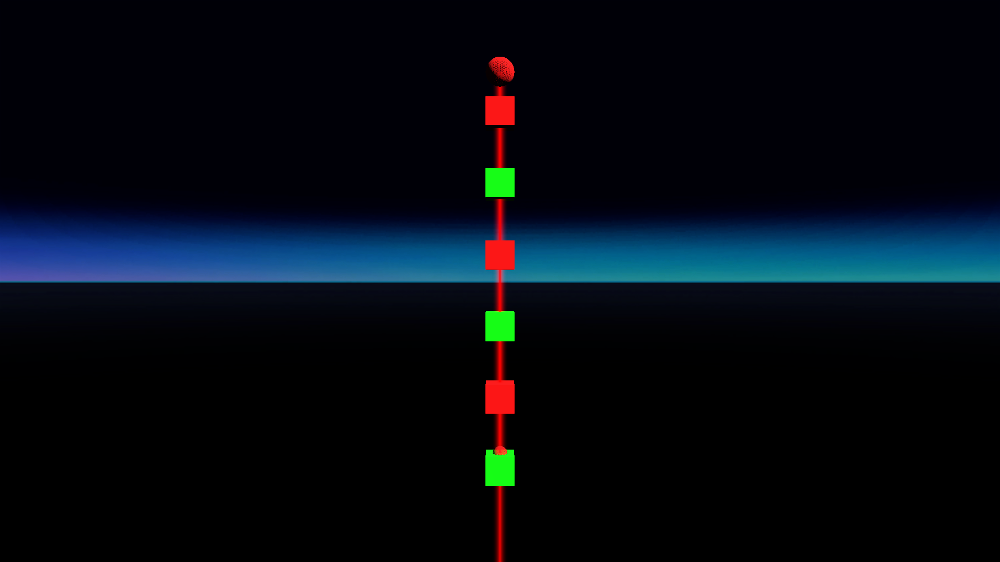
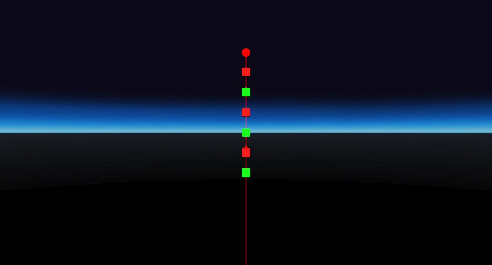
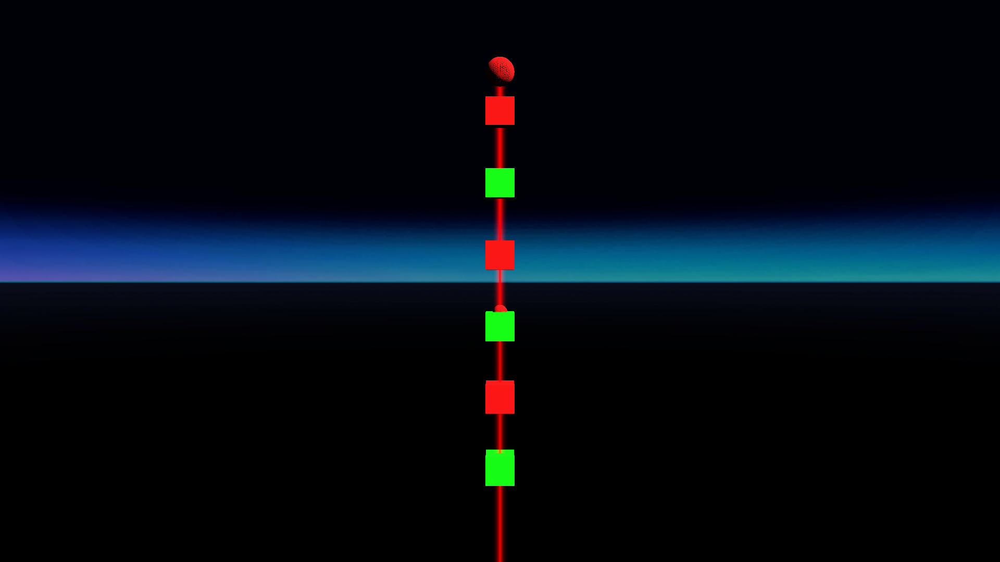

# LaserPointer ignore test
## Run this script URL: [Manual](./test.js?raw=true)   [Auto](./testAuto.js?raw=true)(from menu/Edit/Open and Run scripts from URL...).

## Preconditions
- In an empty region of a domain with editing rights.

## Steps
Press space bar to advance step by step

### Step 1
- 1st position
- 
### Step 2
- 2nd position
- 
### Step 3
- 3rd position
- 
### Step 4
- 4th position
- 
### Step 5
- 5th position
- 
### Step 6
- 6th position
- 
### Step 7
- 7th position
- 
### Step 8
- 8th position
- 
### Step 9
- 9th position
- 
### Step 10
- 10th position
- 
### Step 11
- 11th position
- 
### Step 12
- Clean up
