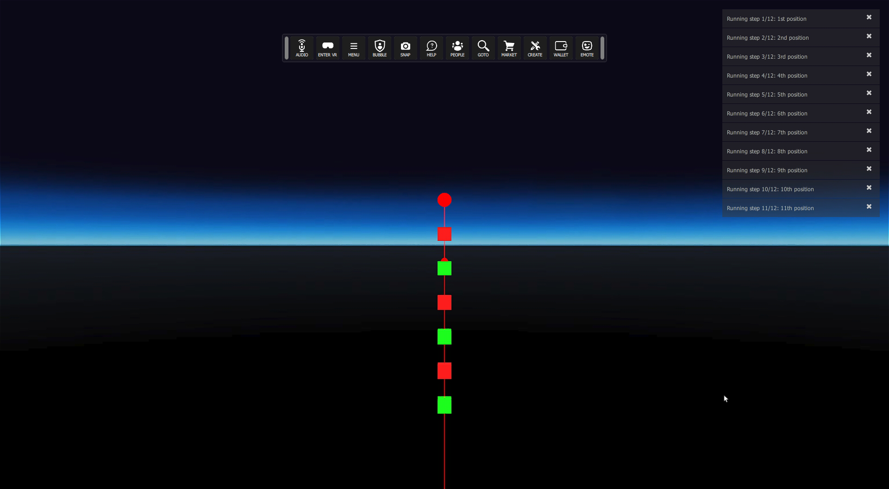

# LaserPointer ignore test
## Run this script URL: [Manual](./test.js?raw=true)   [Auto](./testAuto.js?raw=true)(from menu/Edit/Open and Run scripts from URL...).

## Preconditions
- In an empty region of a domain with editing rights.

## Steps
Press 'n' key to advance step by step

### Step 1
- Move back to see all the objects
### Step 2
- Initial position
- 
### Step 3
- 1st position
### Step 4
- 1st position
- 
### Step 5
- Move to 2nd position
### Step 6
- 2nd position
- 
### Step 7
- Move to 3rd position
### Step 8
- 3rd position
- 
### Step 9
- Move to 4th position
### Step 10
- 4th position
- 
### Step 11
- Move to 5th position
### Step 12
- 5th position
- 
### Step 13
- Move to 6th position
### Step 14
- 6th position
- 
### Step 15
- Move to 7th position
### Step 16
- 7th position
- 
### Step 17
- Move to 8th position
### Step 18
- 8th position
- 
### Step 19
- Move to 9th position
### Step 20
- 9th position
- 
### Step 21
- Move to 10th position
### Step 22
- 10th position
- 
### Step 23
- Move to 11th position
### Step 24
- 11th position
- 
### Step 25
- Clean up
