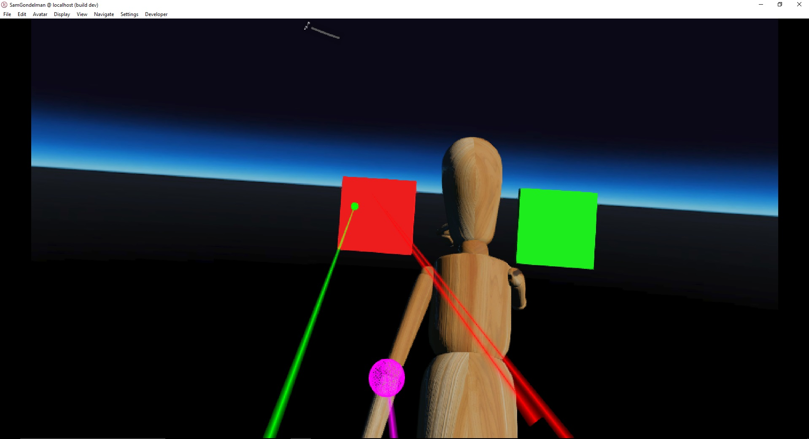
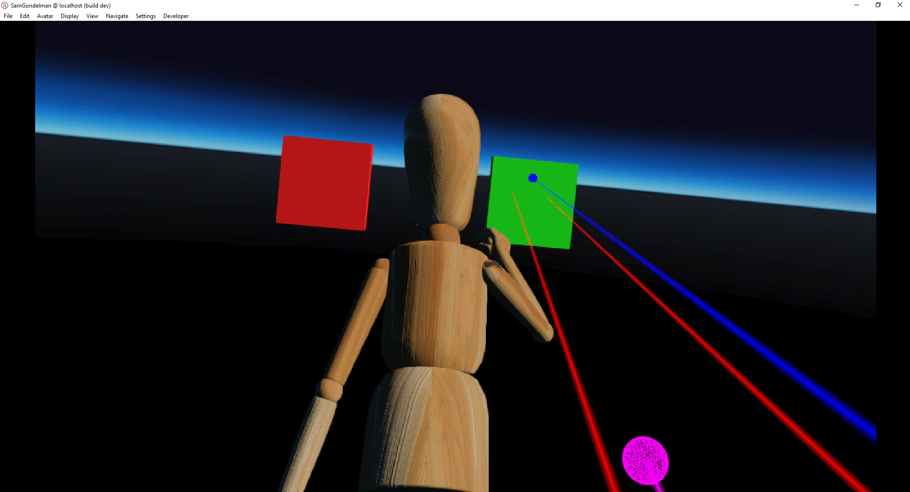
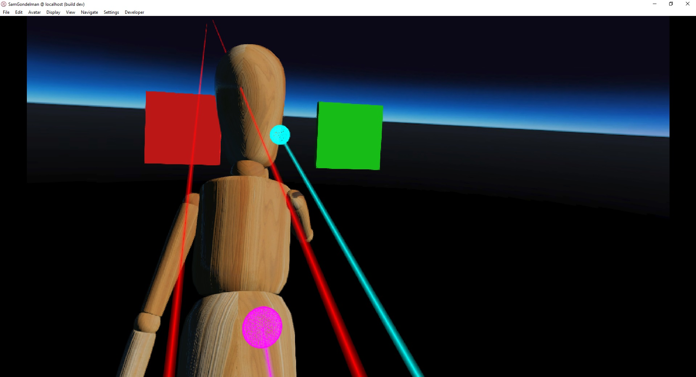
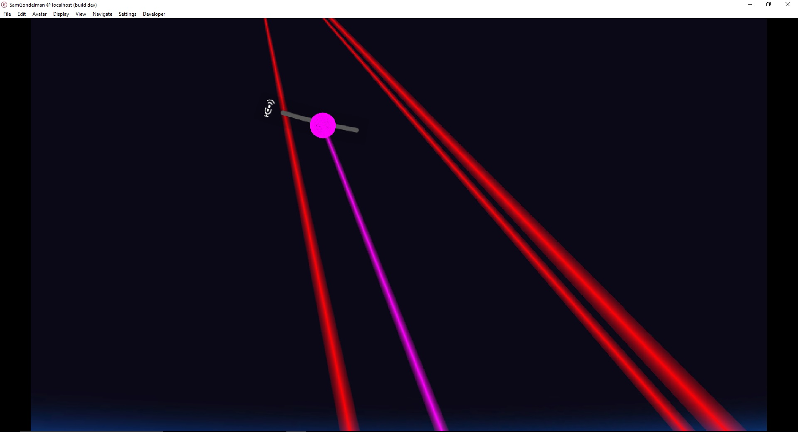

# Laser Pointers

### Preconditions
Interface is running in an empty domain where you have edit rights.

### Steps

#### Step 1
- Run the [joint.js script](./joint.js?raw=true) (from Menu/Edit/Open and Run scripts From URL...).  Put on an HMD with a hand controller.
- Expected:

