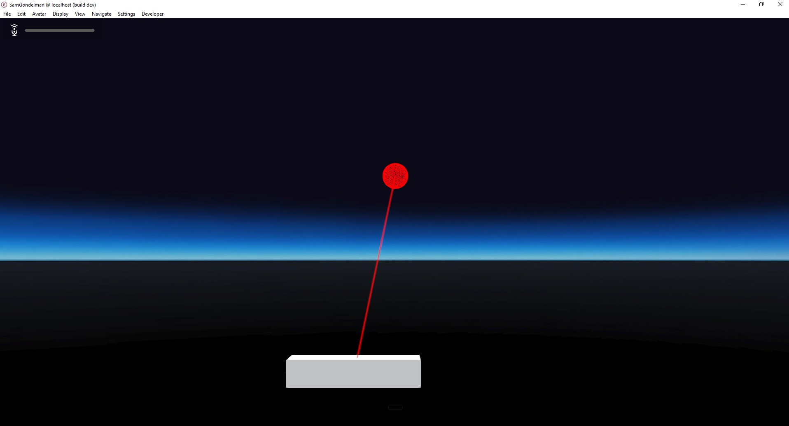

# Laser Pointers

### Preconditions
Interface is running in an empty domain where you have edit rights.

### Steps

#### Step 1
- Run the [lockEnd.js script](./lockEnd.js?raw=true) (from Menu/Edit/Open and Run scripts From URL...).  When the laser hits the cube, it will lock onto the cube's center.
- Expected:

