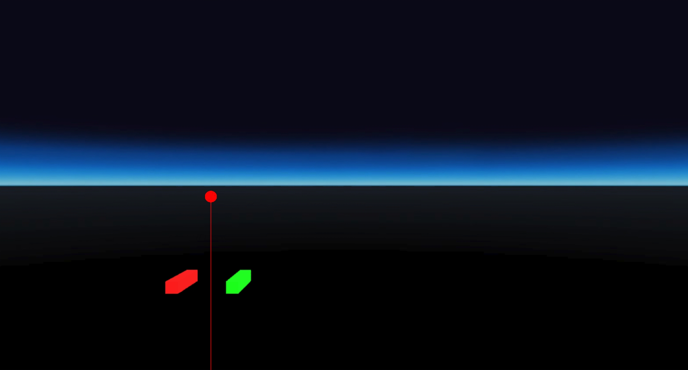

# LaserPointer lockEndUUID test
## Run this script URL: [Manual](./test.js?raw=true)   [Auto](./testAuto.js?raw=true)(from menu/Edit/Open and Run scripts from URL...).

## Preconditions
- In an empty region of a domain with editing rights.

## Steps
Press 'n' key to advance step by step

### Step 1
- Move back to see the objects
### Step 2
- Attached to left:
- 
### Step 3
- Attach to right
### Step 4
- Attached to right:
- 
### Step 5
- Disconnect
### Step 6
- Not attached:
- 
### Step 7
- Clean up
