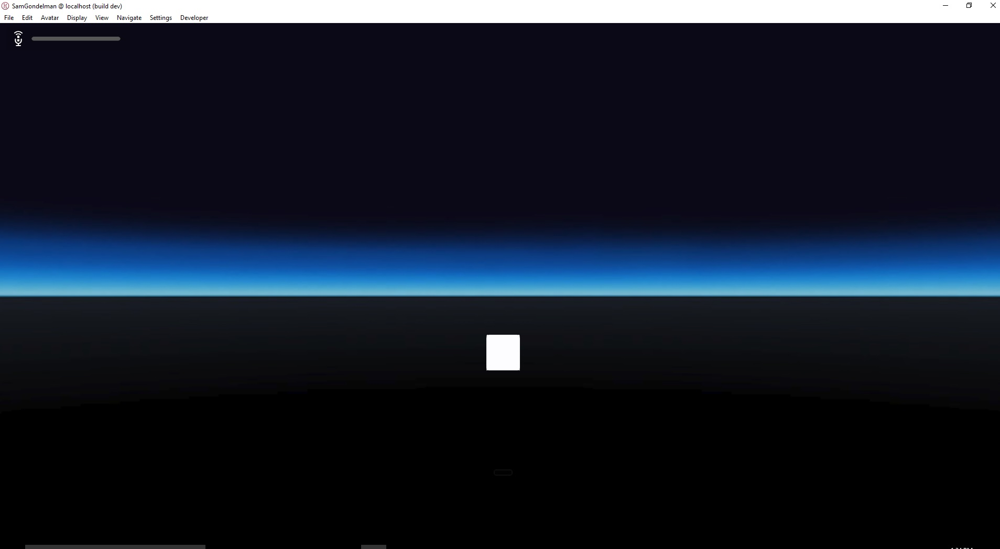
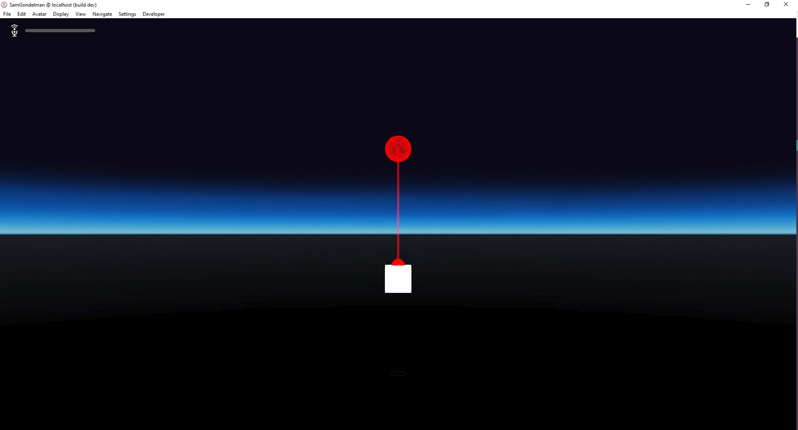
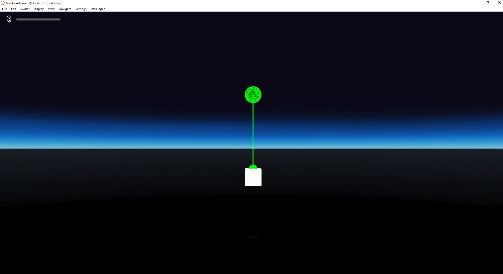
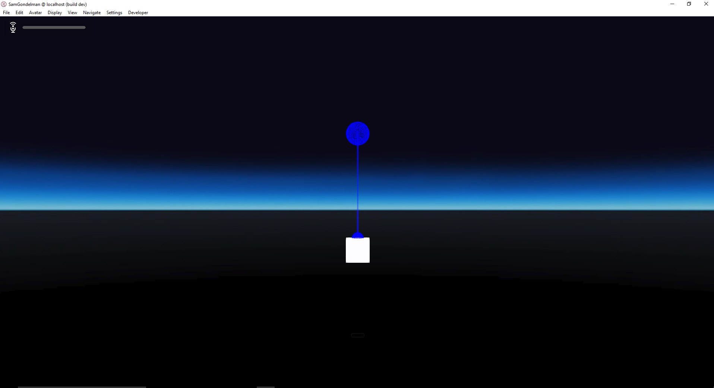
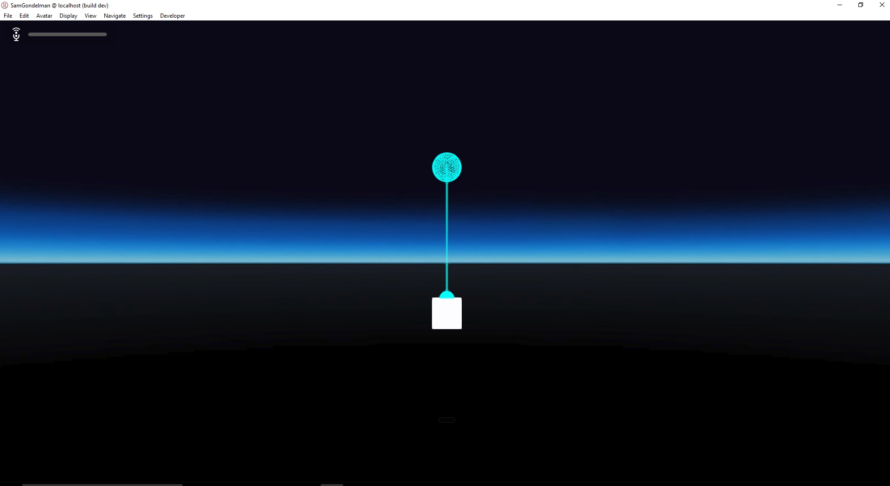
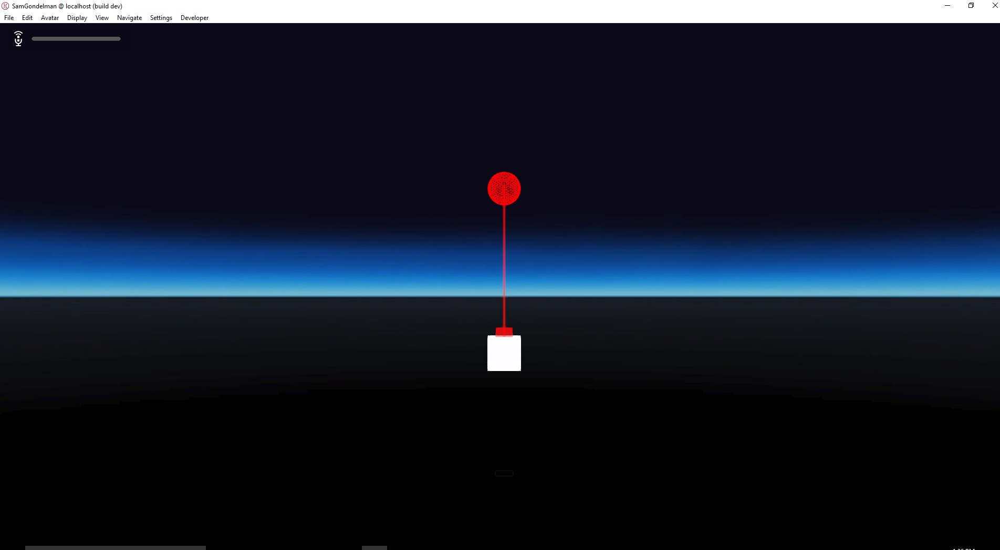

# Laser Pointers

### Preconditions
Interface is running in an empty domain where you have edit rights.

### Steps

#### Step 1
- Run the [renderState.js script](./renderState.js?raw=true) (from Menu/Edit/Open and Run scripts From URL...).  Press [SPACE] to loop through the render states.
- Expected:

