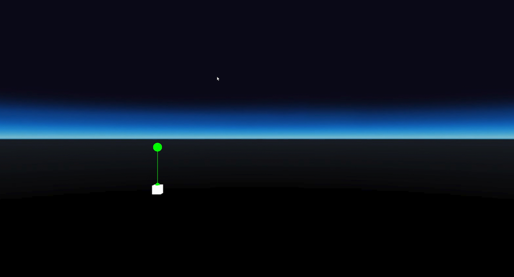
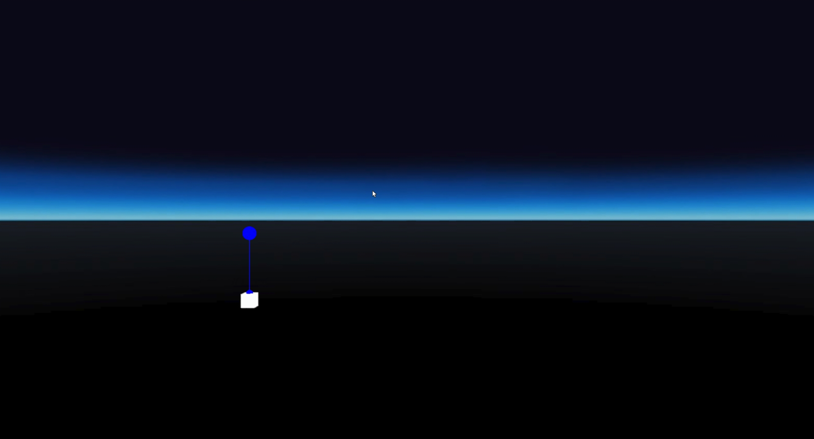
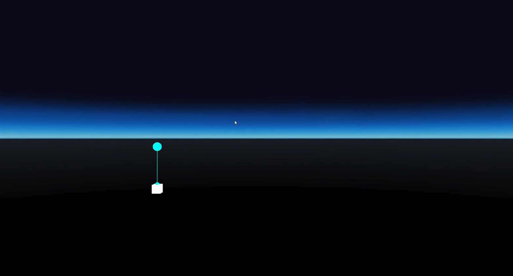
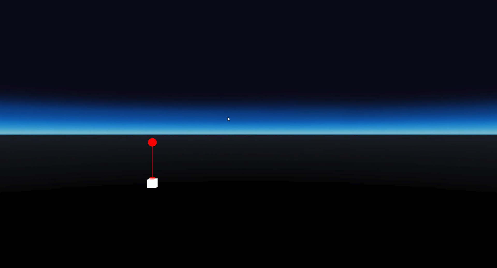

# LaserPointer renderState test
## Run this script URL: [Manual](./test.js?raw=true)   [Auto](./testAuto.js?raw=true)(from menu/Edit/Open and Run scripts from URL...).

## Preconditions
- In an empty region of a domain with editing rights.

## Steps
Press 'n' key to advance step by step

### Step 1
- Not attached
- 
### Step 2
- Attached red - state 1
- 
### Step 3
- Attached green - state 2
- 
### Step 4
- Attached blue - state 3
- 
### Step 5
- Attached cyan - state 4
- 
### Step 6
- Attached red - state 5
- 
### Step 7
- Clean up
