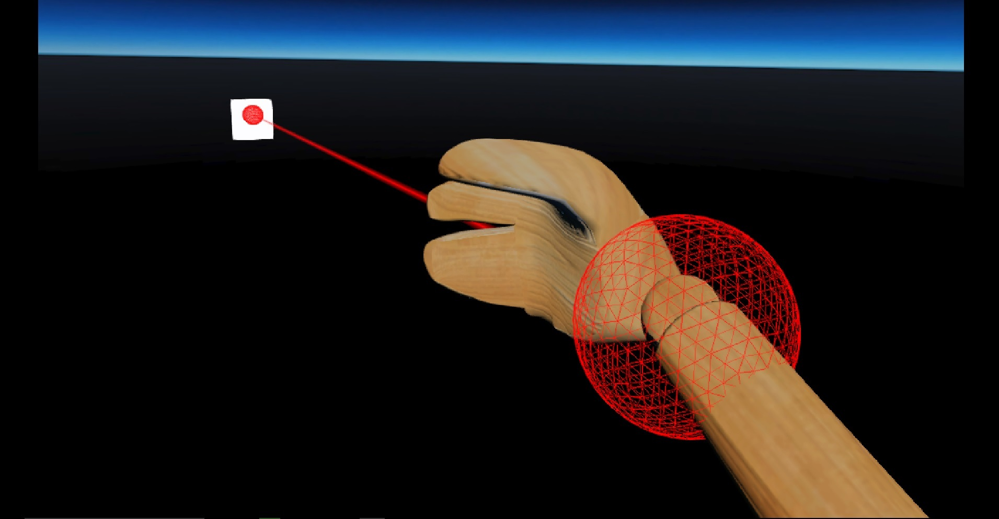
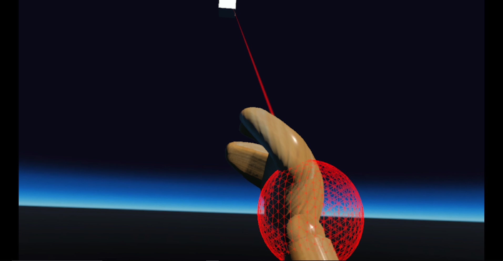
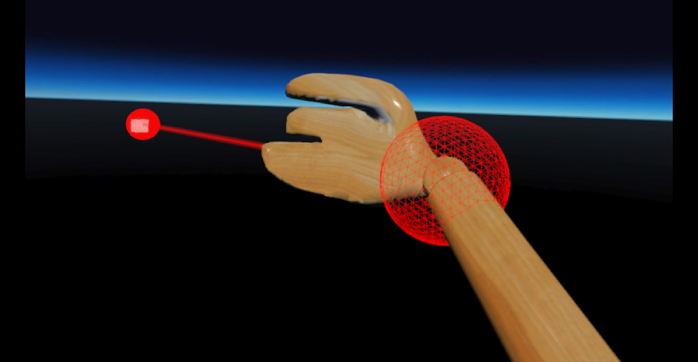

# Laser Pointers

### Preconditions
Interface is running in an empty domain where you have edit rights.

### Steps

#### Step 1
- Run the [scaleWithAvatar.js script](./scaleWithAvatar.js?raw=true) (from Menu/Edit/Open and Run scripts From URL...) in an HMD with hand controllers.  A laser will shoot out of your right hand.  The width of the laser's line will scale with your avatar, so it will never appear very large or very small, relative to you.  Press [SPACE] to try different scales.
- Expected:

