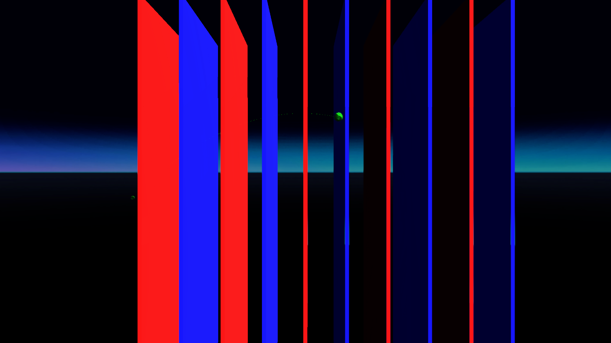

# Parabola ignore test
## Run this script URL: [Manual](./test.js?raw=true)   [Auto](./testAuto.js?raw=true)(from menu/Edit/Open and Run scripts from URL...).

## Preconditions
- In an empty region of a domain with editing rights.

## Steps
Press 'n' key to advance step by step

### Step 1
- Move back to see all the objects
### Step 2
- Initial position
- 
### Step 3
- Position 0
### Step 4
- Position 0
- 
### Step 5
- Position 1
### Step 6
- Position 1
- 
### Step 7
- Position 2
### Step 8
- Position 2
- 
### Step 9
- Position 3
### Step 10
- Position 3
- 
### Step 11
- Position 4
### Step 12
- Position 4
- 
### Step 13
- Position 5
### Step 14
- Position 5
- 
### Step 15
- Position 6
### Step 16
- Position 6
- 
### Step 17
- Position 7
### Step 18
- Position 7
- 
### Step 19
- Position 8
### Step 20
- Position 8
- 
### Step 21
- Position 9
### Step 22
- Position 9
- 
### Step 23
- Clean up