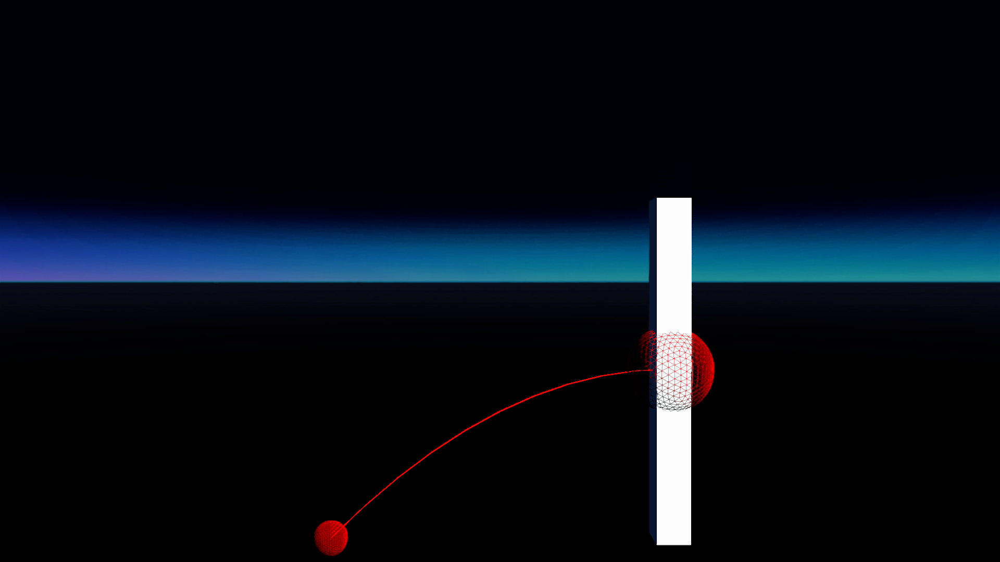
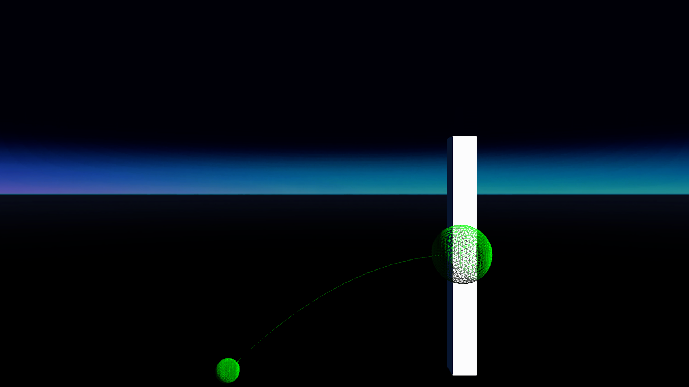
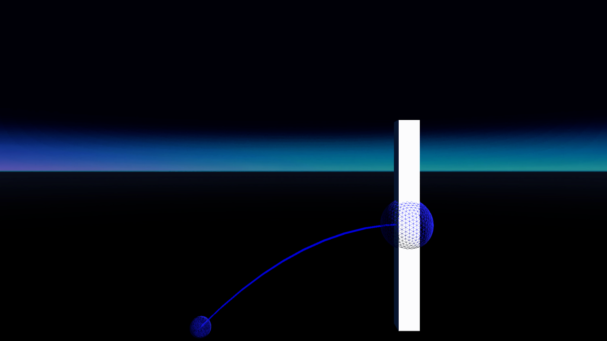
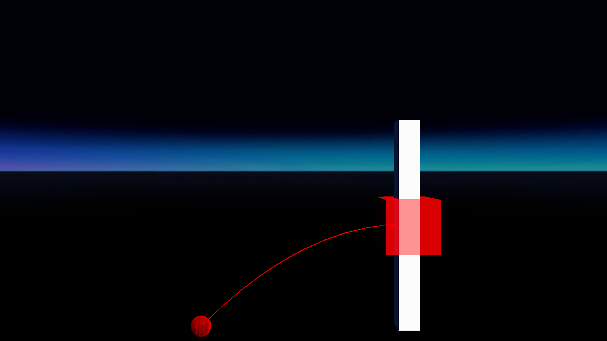

# Parabola renderState test
## Run this script URL: [Manual](https://raw.githubusercontent.com/highfidelity/hifi_tests/master/tests/engine/interaction/pointer/parabola/renderState/test.js)   [Auto](https://raw.githubusercontent.com/highfidelity/hifi_tests/master/tests/engine/interaction/pointer/parabola/renderState/testAuto.js)(from menu/Edit/Open and Run scripts from URL...).

## Preconditions
- In an empty region of a domain with editing rights.

## Steps
Press 'n' key to advance step by step

### Step 1
- Not attached
- 
### Step 2
- Set to state 1 (red)
### Step 3
- Attached red:
- 
### Step 4
- Set to state 2 (green)
### Step 5
- Attached green:
- 
### Step 6
- Set to state 3 (blue)
### Step 7
- Attached blue:
- 
### Step 8
- Set to state 4 (cyan)
### Step 9
- Attached cyan:
- 
### Step 10
- Set to state 5 (red)
### Step 11
- Attached red:
- 
### Step 12
- Clean up
