# Laser Pointers

### Preconditions
Interface is running in an empty domain

### Steps
The steps can be run by executing the [laserPointers.js script](./laserPointers.js?raw=true) (from Menu/Edit/Open and Run scripts From URL...).  Each step is played in sequence by pressing the [SPACE] key.

#### Step 1
- Creates two static laser pointers
- Expected: 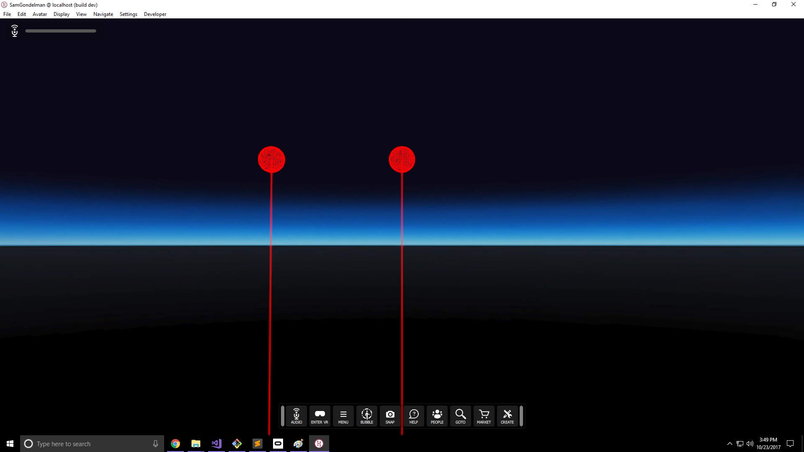

#### Step 2
- Creates an entity that one of the lasers will collide with
- Expected: 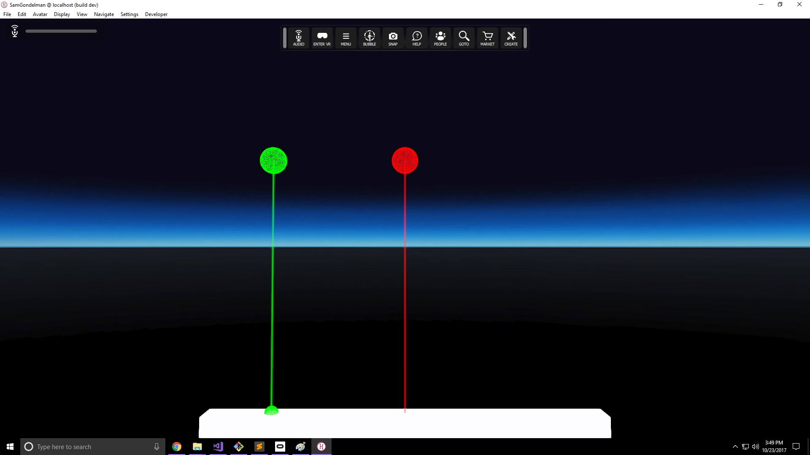

#### Step 3
- Creates an entity and a new laser that ignores the box
- Expected: 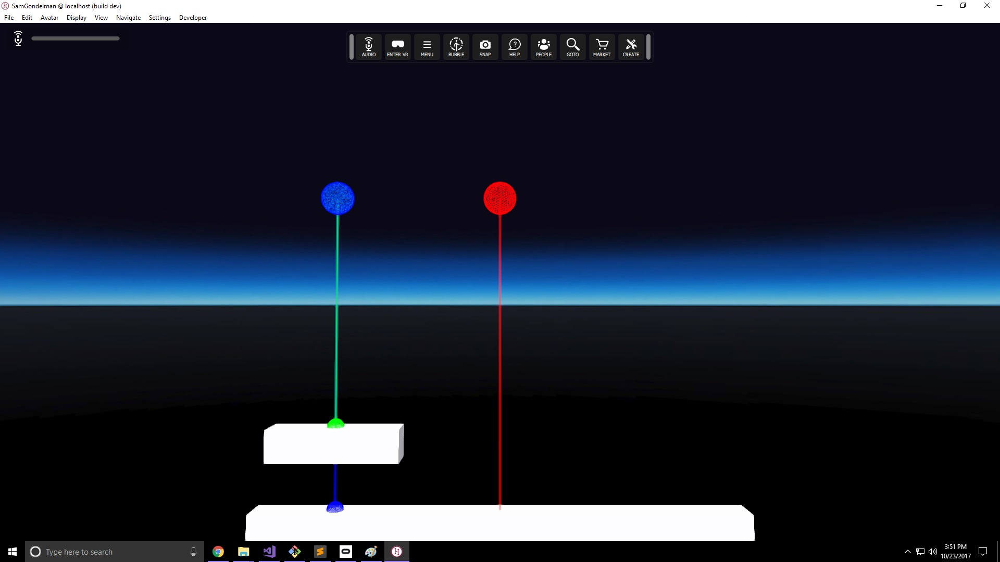

#### Step 4
- Creates an overlay that two of the lasers will collide with
- Expected: 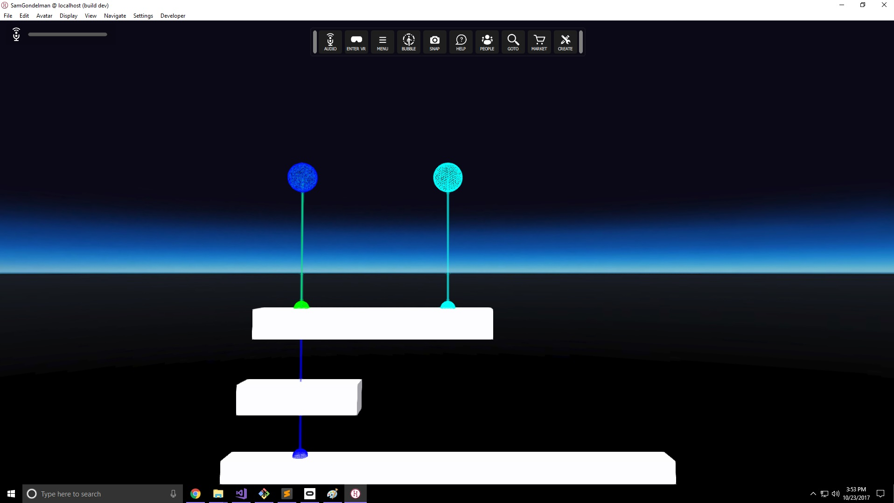

#### Step 5
- Creates a fourth laser that hits the bottom box.  The cube overlay at the end should rest on top of the box instead of halfway inside it, and the cube should rotate to face opposite the direction you are looking.
- Expected: 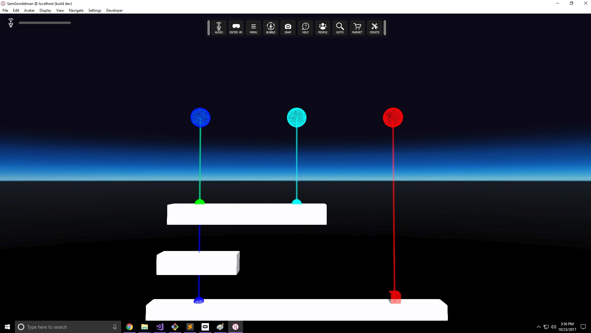
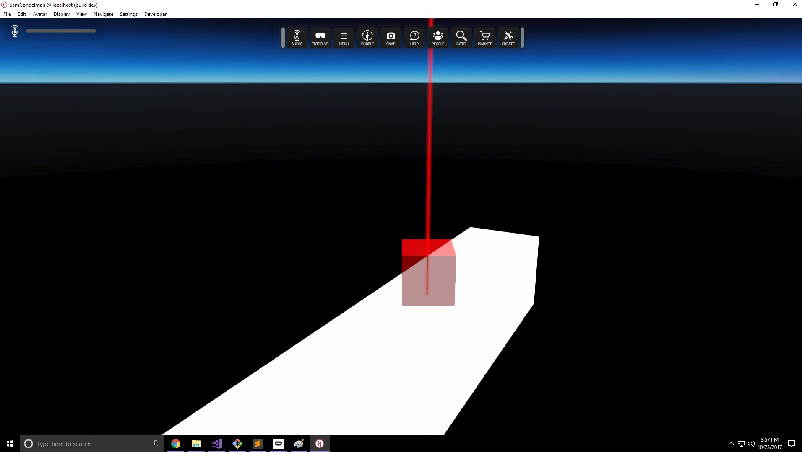

#### Step 6
- Creates a moving box that the fourth laser will lock on to 
- Expected: 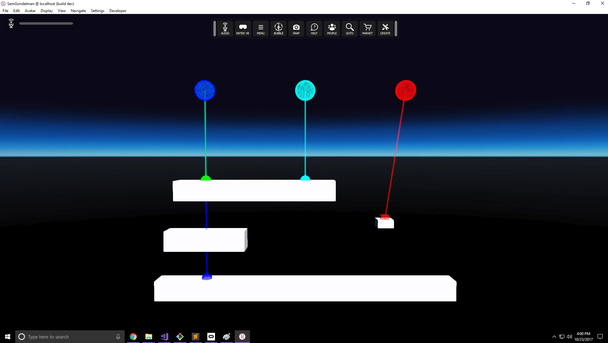

#### Step 7
- Clears lasers.  Adds a laser that follows your mouse.  It should be blue over the top box, green over the other boxes, and cyan over your avatar.
- Expected: 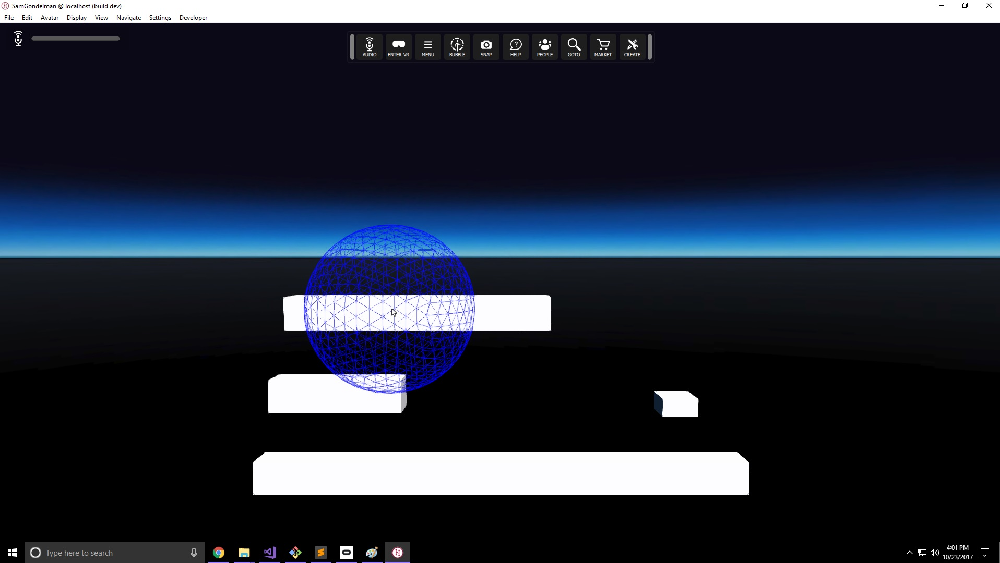
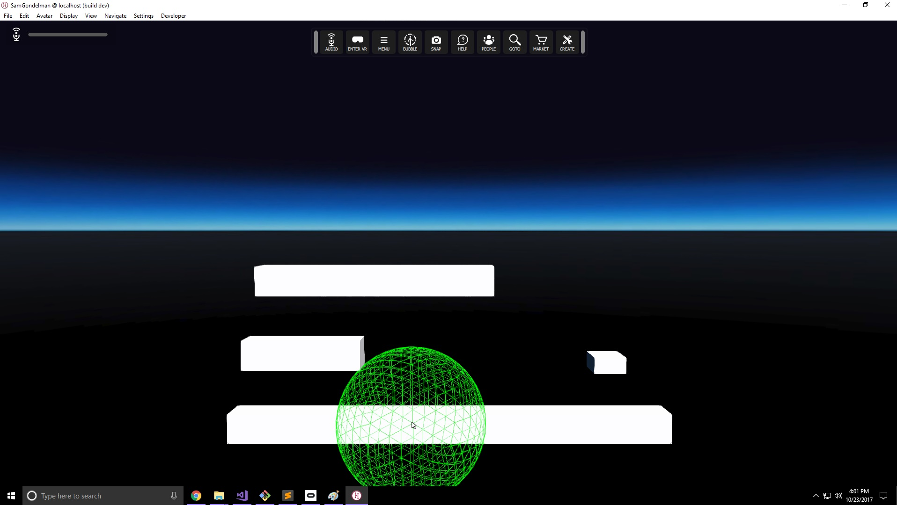

#### Step 8
- Put on an HMD and hand controllers.  Clears mouse laser and creates 4 lasers around your hand.  One collides with entities, one with overlays, one with avatars, and one with the HUD sphere
- Expected: 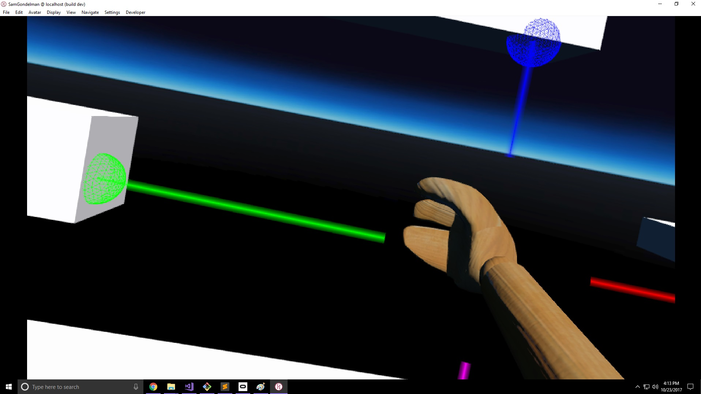
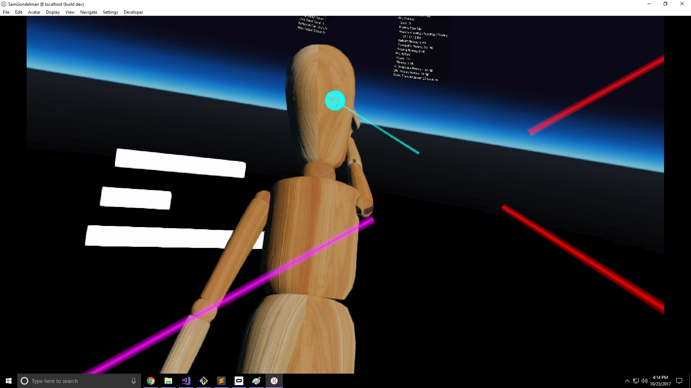
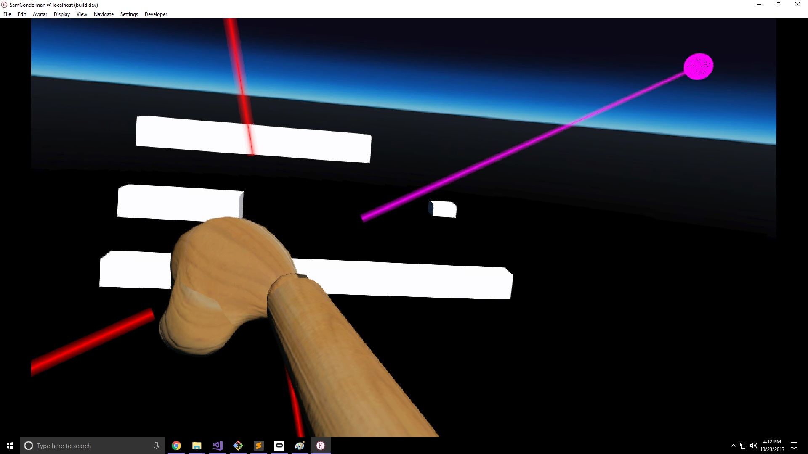