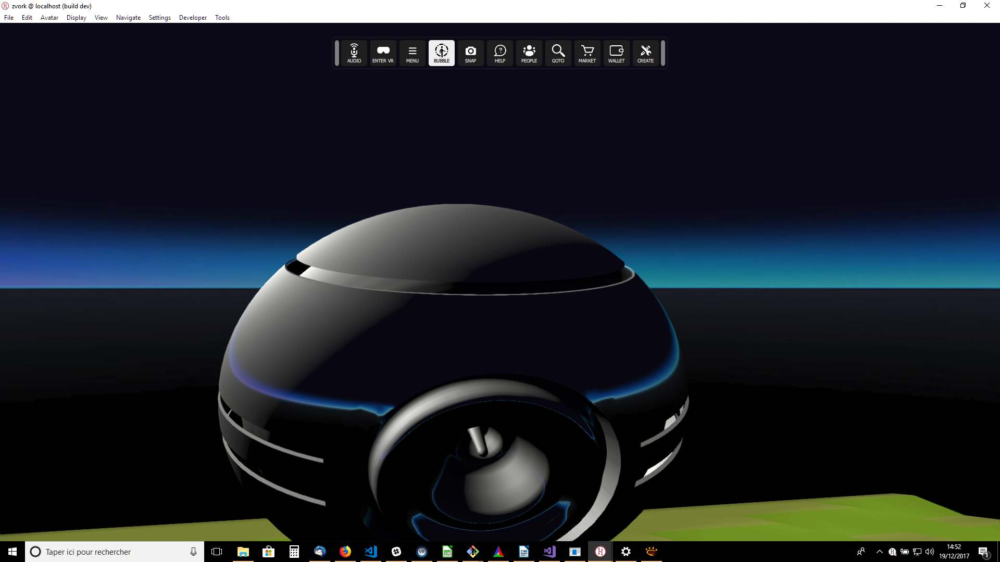

# Engine Backend

### Preconditions
Interface is running, logged in an empty domain with editing rights and with avatar in first person view. Shadows and ambient occlusion should be disabled (see Developer Menu / Graphics).
This test should be performed in Desktop and in HMD mode.

### Steps

The steps can be run manually or by executing the [backend.js script](./backend.js?raw=true) (from menu/Edit/Open and Run scripts From URL...) in which case each step is played in sequence by pressing the [SPACE] key.

The aspect of the objects should remain constant accross the steps, notably their albedo color should not change.

#### Step 1
- Expected: 

#### Step 2
- Expected: 

#### Step 3
- Expected: 

#### Step 4
- Expected: 
