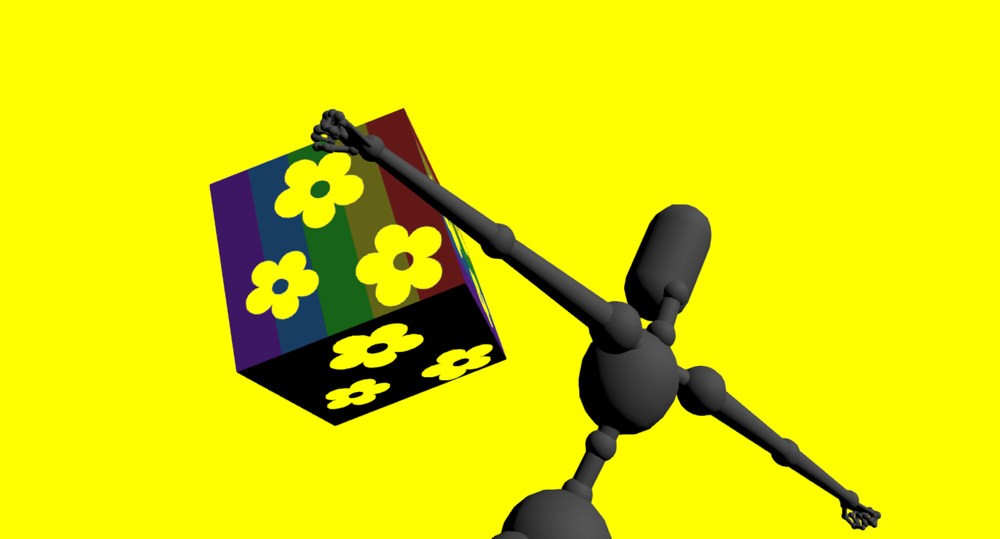

# MyAvatar scaling
## Run this script URL: [Manual](./test.js?raw=true)   [Auto](./testAuto.js?raw=true)(from menu/Edit/Open and Run scripts from URL...).

## Preconditions
- In an empty region of a domain with editing rights.

## Steps
Press 'n' key to advance step by step

### Step 1
- Create zone and model
### Step 2
- Setup avatar
### Step 3
- Snapshot - 1920x1036, 45 degrees
- 
### Step 4
- Change position
### Step 5
- Position has moved back and left
- 
### Step 6
- Change orientation
### Step 7
- Orientation tilted up and yawed right
- 
### Step 8
- Clean up after test
