# Haze Effects
This test verifies the various effects of Haze

### Preconditions
In an empty region of a domain with editing rights

## Automatic Test
Load script <https://raw.githubusercontent.com/NissimHadar/hifi_tests/addRecursionToAutotester/tests/engine/render/effect/haze/testAuto.js>
## Manual Test
Load script <https://raw.githubusercontent.com/NissimHadar/hifi_tests/addRecursionToAutotester/tests/engine/render/effect/haze/test.js>

Press space bar to advance step by step:
1.  Initial state - no haze
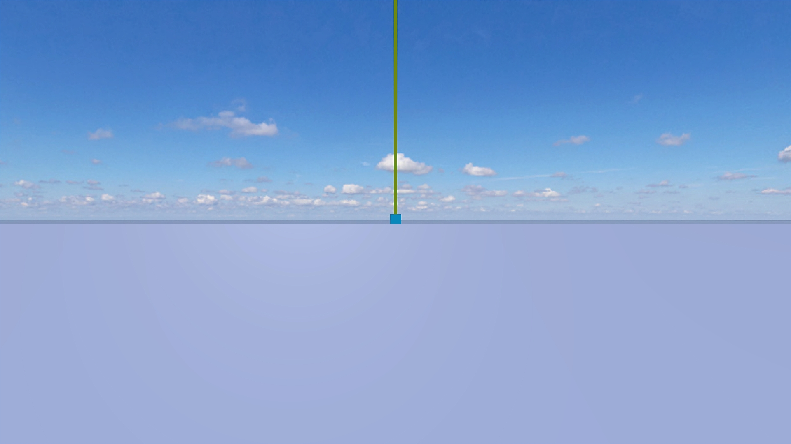
1.  Enable haze, range at 15000 - sky is not visible, tower is visible
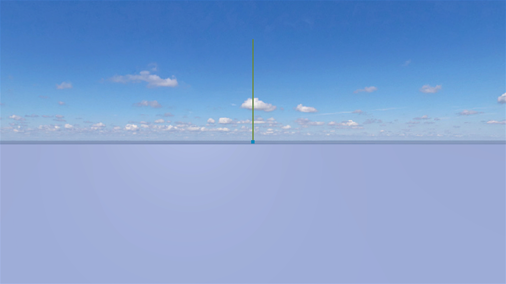
1.  Set range to 500 - tower no longer visible

1.  Turn on altitude effect - top of tower is visible
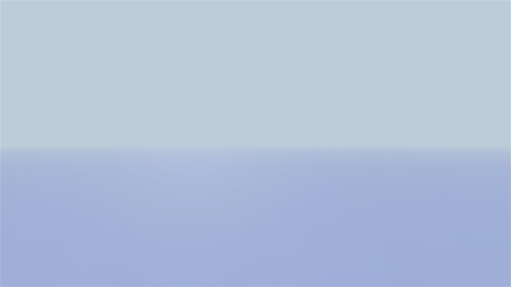
1.  Set ceiling to 500 - tower no longer visible
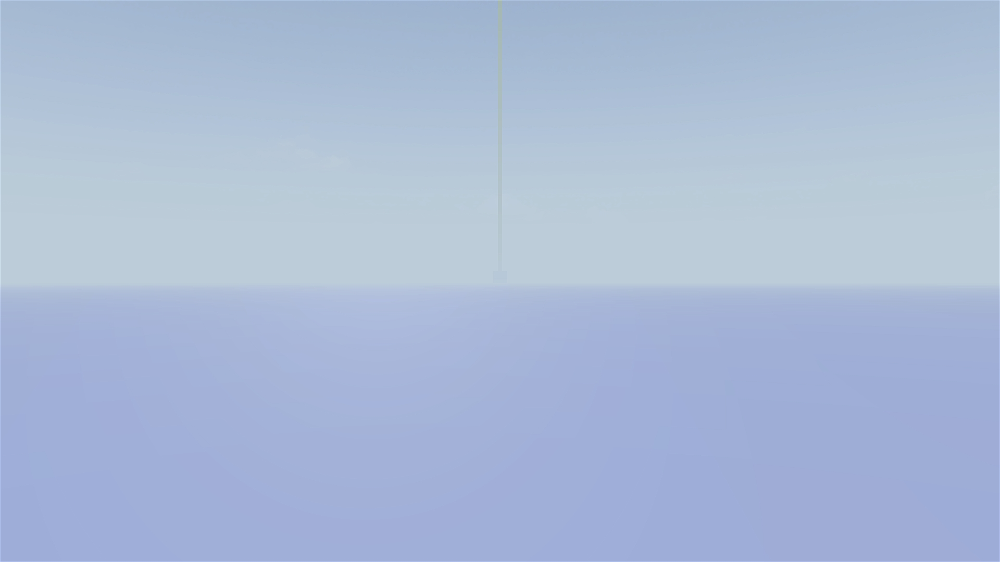
1.  Set base to -200 - top of tower is visible (because haze starts lower)
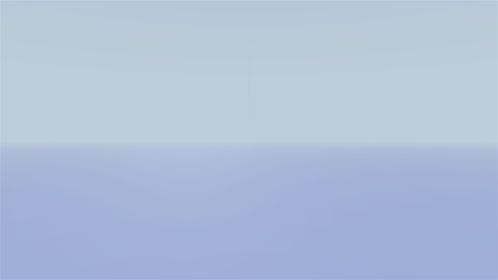
1.  Set base to 0 and haze colour to sandy - haze looks like a sandstorm
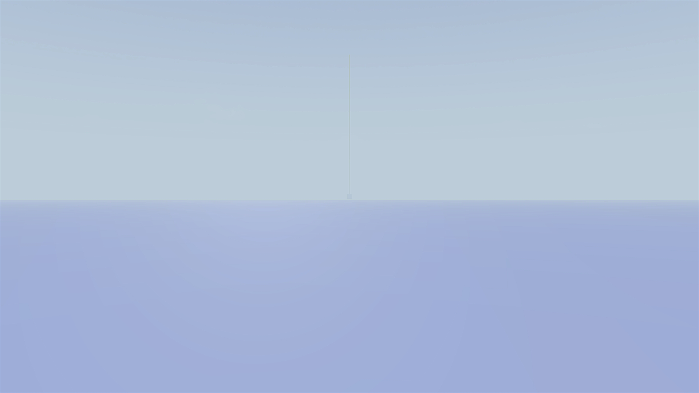
1.  Set background blend to 0.5 - tower and sky are partially visible
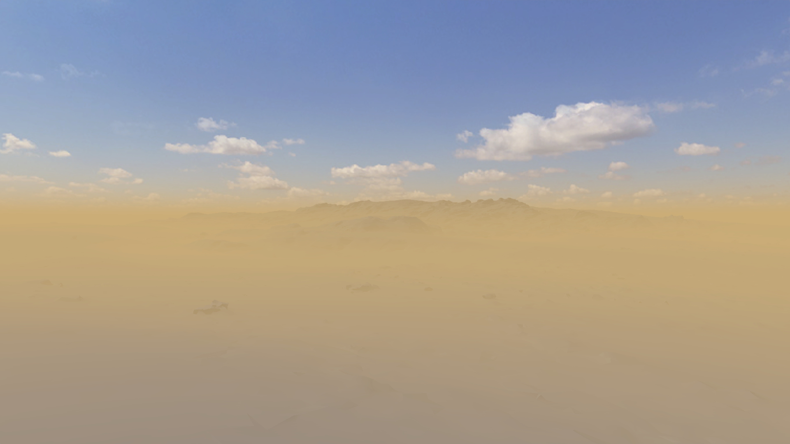
1.  Set background blend to 1 - sky becomes clear
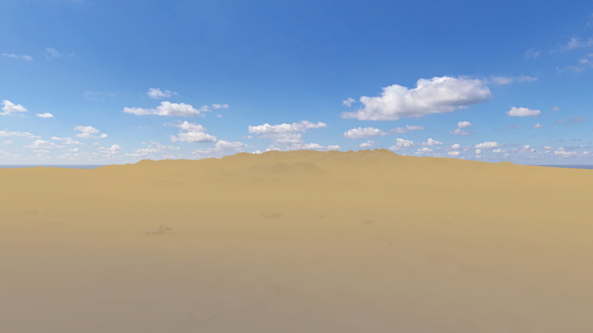
1.  Set background blend back to 0 - cannot see tower nor sky
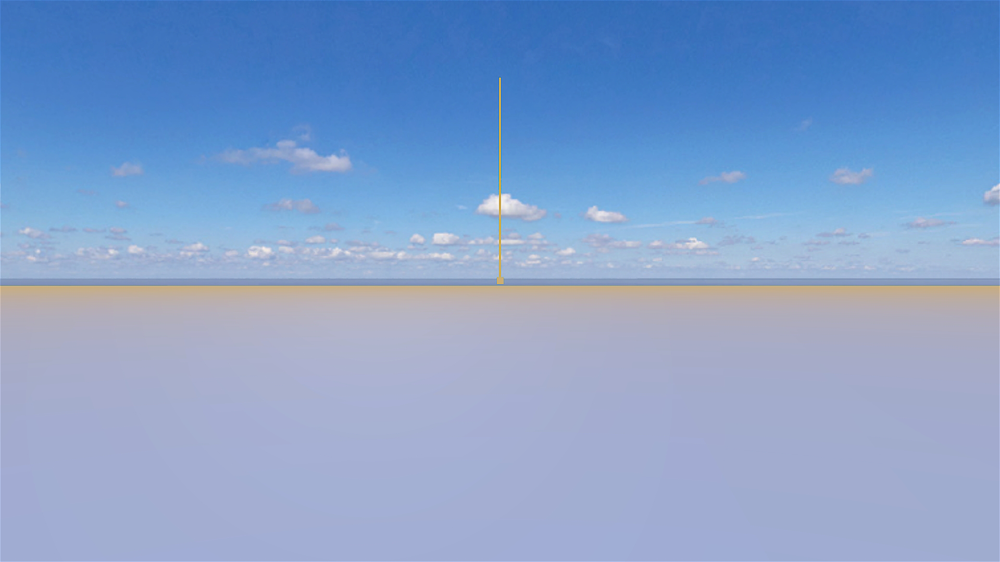
1.  Test glare effect (sun is 20 degrees elevation, 010 azimuth) - large burgundy sun glare effect can be seen
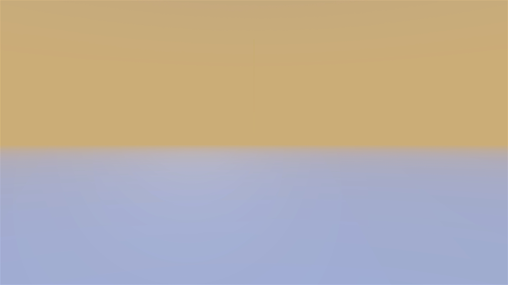Set glare angle to 5 degrees - sun glare angle becomes smallerInitial state - no haze
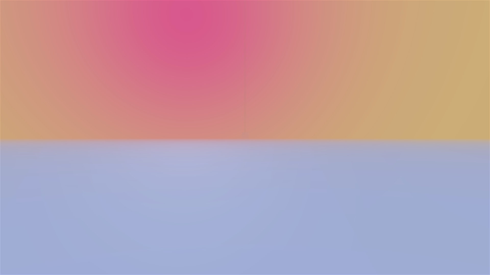