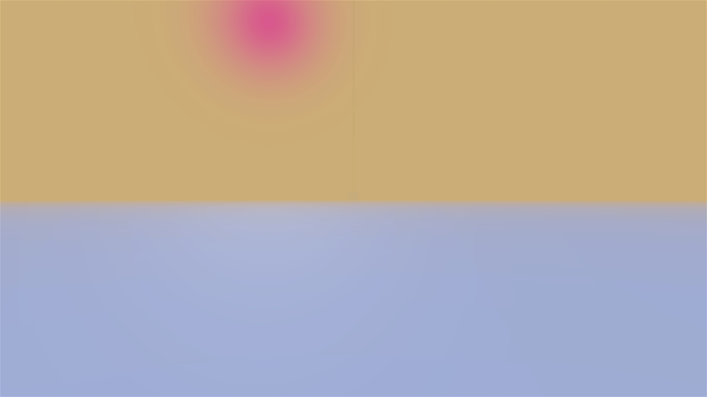

# effect - haze
## Run this script URL: [Manual](./test.js?raw=true)   [Auto](./testAuto.js?raw=true)(from menu/Edit/Open and Run scripts from URL...).

## Preconditions
- In an empty region of a domain with editing rights.

## Platforms
Run the test on each of the following platforms
## Displays
Run the test on each of the following displays
## Processors
Run the test on each of the following processors
## Graphics Cards
Run the test on graphics cards from each of the following vendors
## Steps
Press space bar to advance step by step

### Step 1
- Initial state
- 
### Step 2
- Enable haze, range at 15000 - sky is not visible, tower is visible
- 
### Step 3
- Set range to 500 - tower no longer visible
- 
### Step 4
- Turn on altitude effect - top of tower is visible
- 
### Step 5
- Set ceiling to 500 - tower no longer visible
- 
### Step 6
- Set base to -200 - top of tower is visible
- 
### Step 7
- Set base to 0 and haze colour to sandy - haze looks like a sandstorm
- 
### Step 8
- Set background blend to 0.5 - tower and sky are partially visible
- 
### Step 9
- Set background blend to 1 - sky becomes clear
- 
### Step 10
- Set background blend back to 0 - cannot see tower nor sky
- 
### Step 11
- Test glare effect (sun is 20 degrees elevation, 010 azimuth) - large burgundy sun glare effect can be seen
- 
### Step 12
- Set glare angle to 5 degrees - sun glare angle becomes smaller
- 
### Step 13
- Clean up
- 
