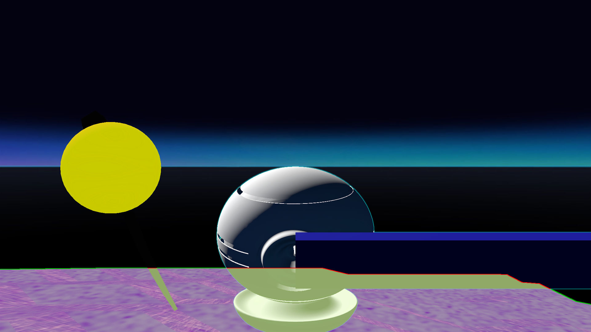

# Highlight Test
## Run this script URL: [Manual](./test.js?raw=true)   [Auto](./testAuto.js?raw=true)(from menu/Edit/Open and Run scripts from URL...).

## Preconditions
- In an empty region of a domain with editing rights.

## Steps
Press 'n' key to advance step by step

### Step 1
- Position secondary camera
### Step 2
- Highlight box
- 
### Step 3
- Highlight Model Entity
- 
### Step 4
- Highlight Sphere Entity
- 
### Step 5
- Highlight Avatar
- 
### Step 6
- Highlight Model Overlay
- 
### Step 7
- Highlight Polyvox Entity
- 
### Step 8
- Edit Highlight Style
- 
### Step 9
- Disable Highlight Style
- 
### Step 10
- Highlight Sphere Entity With Different Style
- 
### Step 11
- Disable All Highlights
- 
### Step 12
- No Highlights
- 
### Step 13
- Clean up after test
