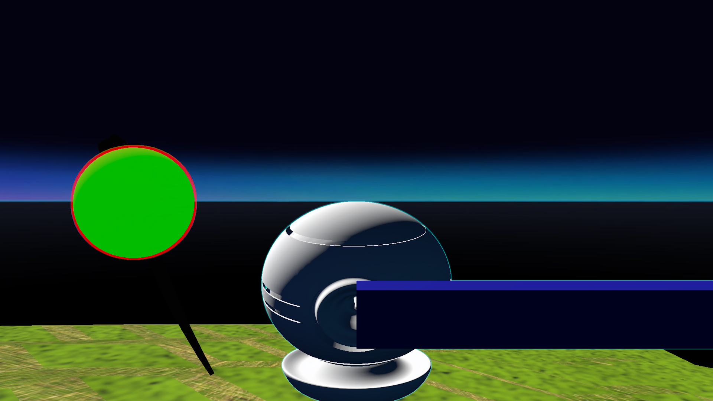
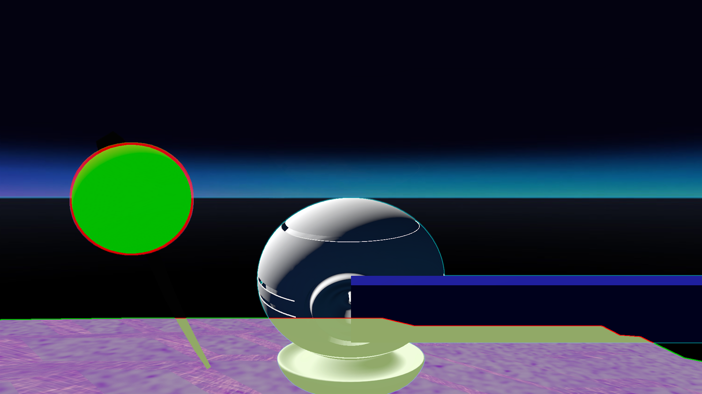

# Highlight Test
## Run this script URL: [Manual](./test.js?raw=true)   [Auto](./testAuto.js?raw=true)(from menu/Edit/Open and Run scripts from URL...).

## Preconditions
- In an empty region of a domain with editing rights.

## Steps
Press n key to advance step by step

### Step 1
- Step 1
- 
### Step 2
- Step 2
- 
### Step 3
- Step 3
- 
### Step 4
- Step 4
- 
### Step 5
- Step 5
- 
### Step 6
- Step 6
- 
### Step 7
- Step 7
- 
### Step 8
- Step 8
- 
### Step 9
- Step 9
- 
### Step 10
- Step 10
- 
### Step 11
- Step 11
- 
### Step 12
- Take snapshot
- 
### Step 13
- Clean up after test
