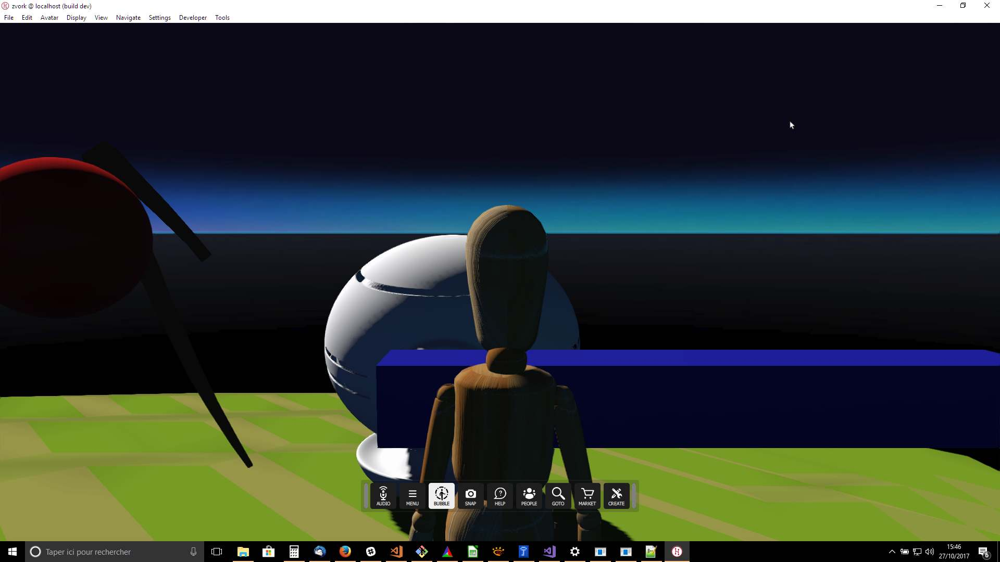
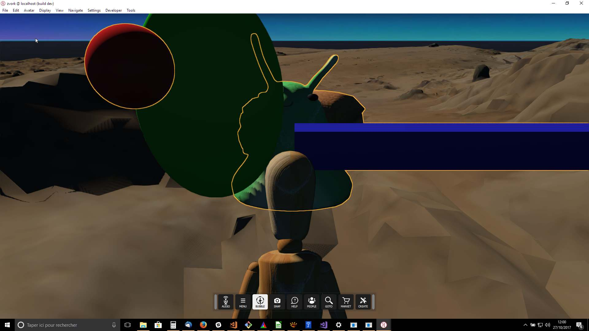
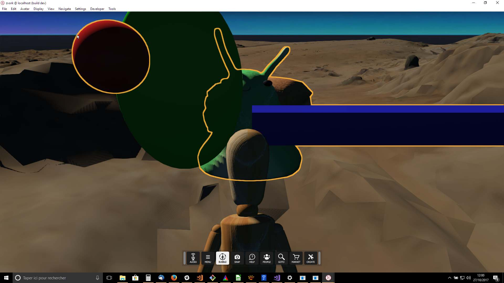
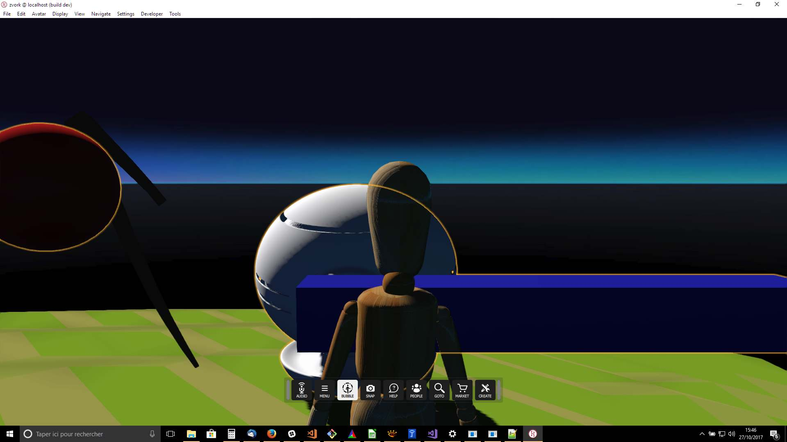
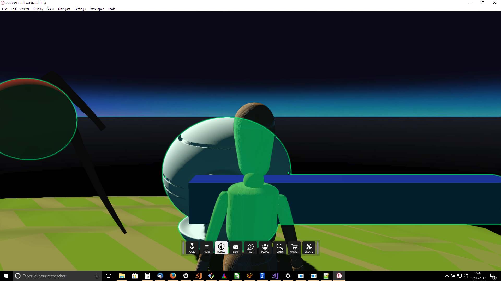
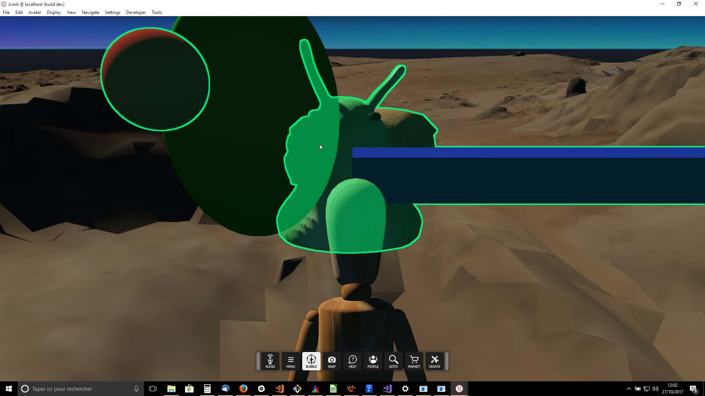
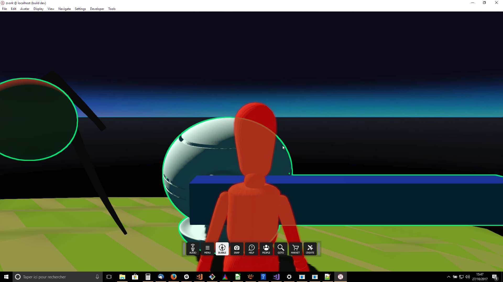
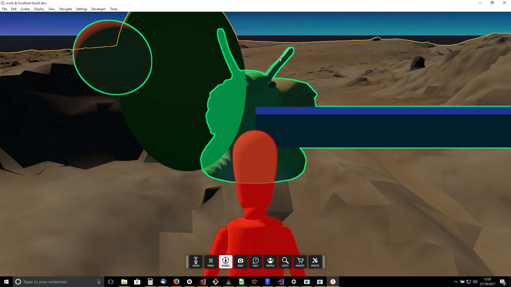
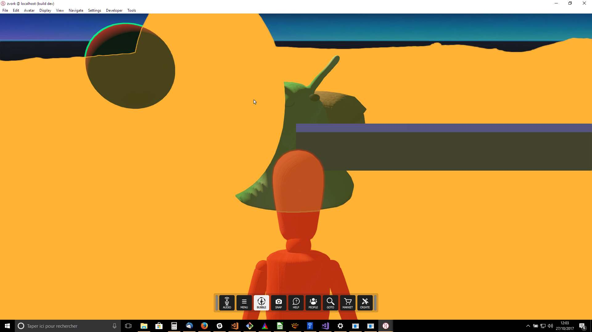

# Engine Render Outline Effect

### Preconditions
Interface is running, logged in an empty region of a domain with editing rights and with avatar in third person view. This test should be performed in Desktop and in HMD mode.

### Steps

During all steps, rendering should be stable in time. Rune the [outline.js script](./outline.js?raw=true) (from menu/Edit/Open and Run scripts From URL...) and play each step in sequence by pressing the [SPACE] key.

#### Step 1
- Expected: 

#### Step 2
- Expected: 

#### Step 3
- Expected: 

#### Step 4
- Expected: 

#### Step 5
- Expected: 

#### Step 6
- Expected: 

#### Step 7
- Expected: 

#### Step 8
- Expected: 

#### Step 9
- Expected: 

#### Step 10
- Expected: 

#### Step 11
- Expected: the new outline should render over the first two

#### Step 12
- Expected: 
