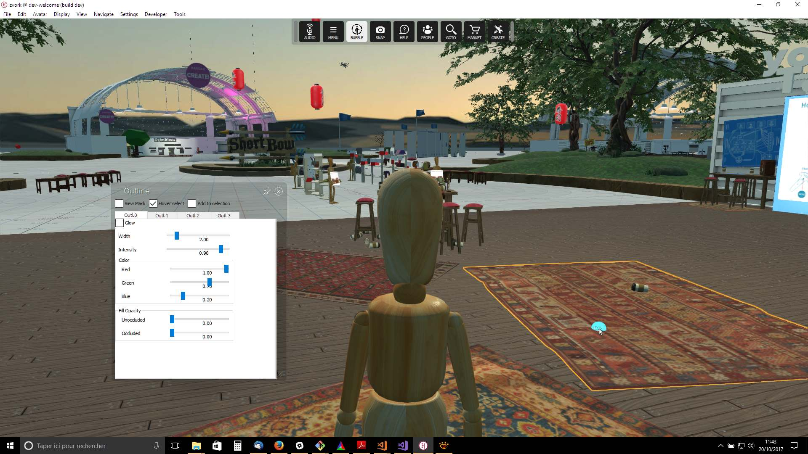
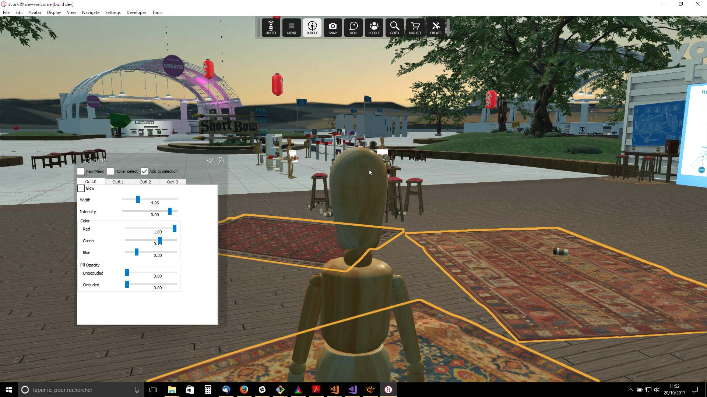
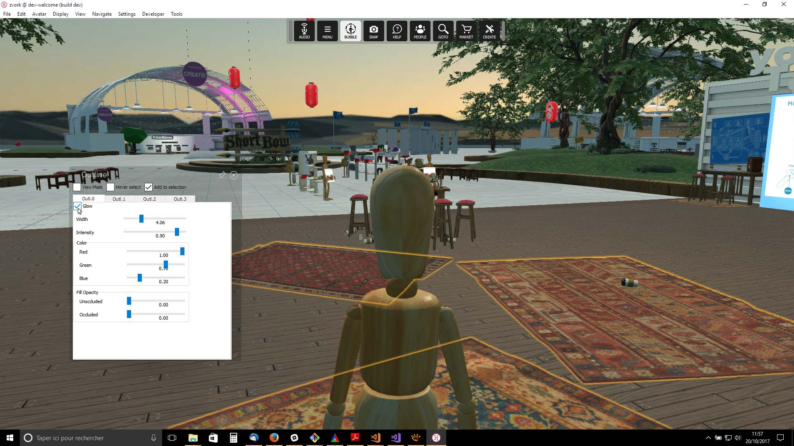
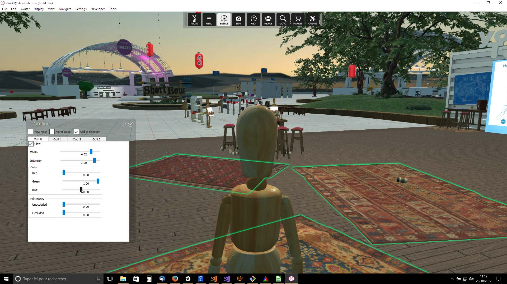
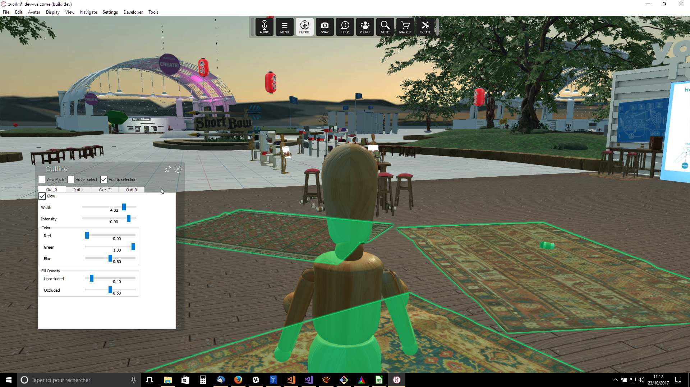
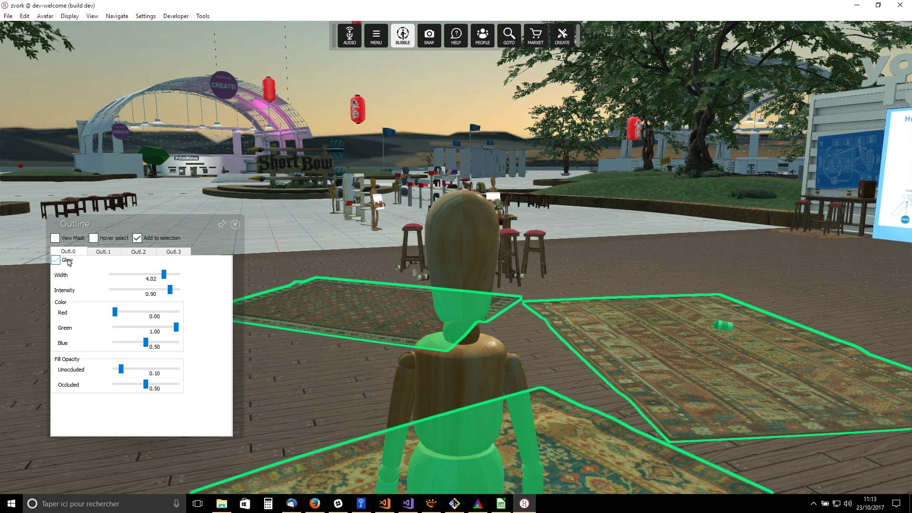
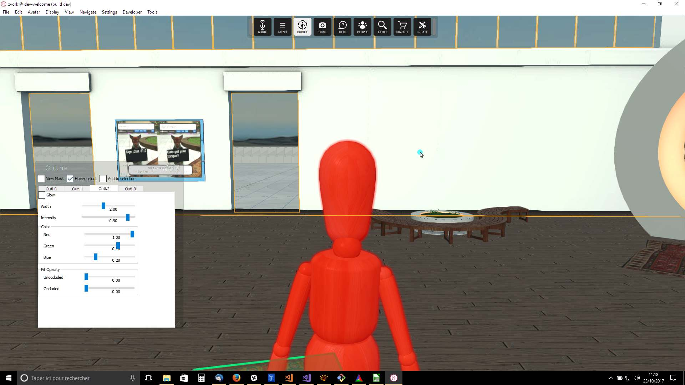

# Engine Render Outline Effect

### Preconditions
Interface is running, logged in the 'Welcome' or 'Dev-Welcome' domain at the initial position with avatar in third person view.

### Steps

During all steps, rendering should be stable in time. The steps can be run manually or by executing the [outline.js script](./outline.js?raw=true) (from menu/Edit/Open and Run scripts From URL...) in which case each step is played in sequence by pressing the [SPACE] key.

#### Step 1
- Run the 'debugOutline.js' script located in the 'hifi/scripts/developer/utilities/render' folder.
- Expected: 

#### Step 2
- Enable the 'Hover select' checkbox, move the mouse cursor over the rug on the floor to the right and hover over it for 1 second. The rug should be surrounded by an orange outline.
- Expected: 

#### Step 3
- Enable the 'Add selection' checkbox, move the mouse cursor over all three visible rugs and hover for 1 second in turn over them to select them.
- Expected: 

#### Step 4
- Quickly move cursor to 'Hover select' checkbox and disable it to freeze the outlined objects (If another object is selected in the process you can uncheck 'Add selection' to reset selection and redo step 3). Change the 'Width' slider to approximately 4.
- Expected: 

#### Step 5
- Enable the 'Glow' checkbox.
- Expected: 

#### Step 6
- Set the 'Red', 'Green' and 'Blue' sliders in the 'Color' group box to respectively the values 0, 1 and 0.5
- Expected: 

#### Step 7
- Set the 'Unoccluded' and 'Occluded' sliders in the 'Fill Opacity' group box to respectively the values 0.1, 0.5
- Expected: 

#### Step 8
- Disable the 'Glow' checkbox.
- Expected: 

#### Step 9
- Click on the 'Outl.1' tab to add selections to the second outline group.
- Disable 'Add selection'
- Enable 'Hover select'
- Hover the mouse over your avatar.
- Expected, the new outline should render on top of the previous one: 

#### Step 10
- Quickly move mouse over the 'Hover select' checkbox so as not to loose the selection and disable 'Hover select'.
- Enable 'Glow'
- Set 'Width' to 5
- Set 'Intensity' to 0.5
- Set color 'Red', 'Green' and 'Blue' to respectively 1, 0 and 0
- Set 'Unoccluded' fill opacity to 0.65
- Expected: 

#### Step 11
- Click on the 'Outl.2' tab to add selections to the third outline group.
- Disable 'Add selection'
- Enable 'Hover select'
- Hover over the base of the tree at the top left of the screen.
- Expected: the new outline should render over the first two

#### Step 12
- Turn view 180° and hover over the white wall at the back.
- Expected: 

#### Step 13
- Set 'Unoccluded' fill to 1 and 'Occluded' fill to 0.25
- Hover over the white wall at the back.
- Expected: 

 